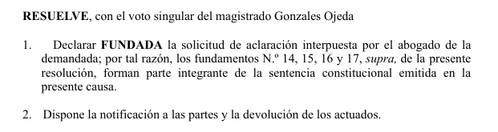
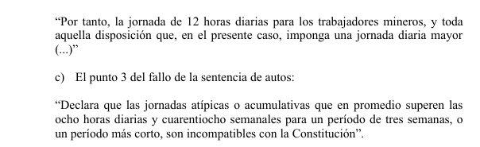
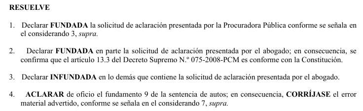

class: inverse, middle, center

```{r setup, include=FALSE}
options(htmltools.dir.version = FALSE)
knitr::opts_chunk$set(
  fig.width=9, fig.height=3.5, fig.retina=3,
  out.width = "100%",
  cache = FALSE,
  echo = TRUE,
  message = FALSE, 
  warning = FALSE,
  hiline = TRUE
)
```

```{r xaringan-themer, include=FALSE, warning=FALSE}
library(xaringanthemer)
style_duo_accent(
  primary_color = "#035AA6",
  secondary_color = "#03A696",
  inverse_header_color = "#FFFFFF"
)
```

```{r xaringan-logo, echo=FALSE}
xaringanExtra::use_logo(
  image_url = "https://raw.githubusercontent.com/PaulParedes/materiales/master/logo-amag-removebg.png"
)
```

```{r, echo=FALSE}
xaringanExtra::use_webcam()
```


# Bienvenidos

---
# Plan de la clase

1. Breve repaso: ¿qué es el precedente?

2. Analizar el video "El precedente judicial en el proyecto de reforma del Código Procesal Civil"

3. Análisis de casos: precedentes vinculantes constitucionales

.pull-left[
+ Caso 5: Jornada de trabajo
+ Caso 6: Derecho al trabajo
+ Caso 7: Derecho a la pensión
+ Caso 10: Régimen CAS
]

.pull-right[

+ Caso 11: Exigencia de concurso público en el acceso a la función pública
+ Caso 12: Vía igualmente satisfactoria
+ Caso 13: Hostigamiento sexual
+ Caso 14: Cargo de confianza en el sector público
]

<ol start="4">
  <li>Caso: Bono por función fiscal</li>
  <br>
  <li>Análisis de los plenos jurisdiccionales supremos</li>
  <br>
  <li>Conclusiones</li>
</ol>


---
class: inverse, center, middle

# 1. Breve repaso

# ¿Qué es el precedente?

---
class: inverse, center, middle

# Los precedentes en el ordenamiento jurídico peruano

---
# Ley 31307 - C.P.Const.

> Artículo VI. Precedente vinculante

> Las sentencias del Tribunal Constitucional que adquieren la autoridad de cosa juzgada constituyen precedente vinculante cuando así lo exprese la sentencia, precisando el extremo de su efecto normativo, **formulando la regla jurídica en la que consiste el precedente**. Cuando el Tribunal Constitucional resuelva apartándose del precedente, debe expresar los fundamentos de hecho y de derecho que sustentan la sentencia y las razones por las cuales se aparta del precedente.

> **Para crear, modificar, apartarse o dejar sin efecto un precedente vinculante se requiere la reunión del Pleno del Tribunal Constitucional y el voto conforme de cinco
magistrados**.

> **En los procesos de acción popular, la sala competente de la Corte Suprema de la República también puede crear, modificar o derogar precedentes vinculantes con el voto conforme de cuatro jueces supremos. La sentencia que lo establece formula la regla jurídica en la que consiste el precedente, expresa el extremo de su efecto normativo y, en el caso de su apartamiento, los fundamentos de hecho y de derecho en que se sustenta**.

---
# Ley 31307 - C.P.Const.

> Artículo VII. Control difuso e interpretación
constitucional

> Cuando exista incompatibilidad entre la Constitución y otra norma de inferior jerarquía, el juez debe preferir la primera, siempre que ello sea relevante para resolver la controversia y no sea posible obtener una interpretación conforme a la Constitución.

> Los jueces no pueden dejar de aplicar una norma cuya constitucionalidad haya sido confirmada en un proceso de inconstitucionalidad o en un proceso de acción popular.

> **Los jueces interpretan y aplican las leyes o toda norma con rango de ley y los reglamentos según los preceptos y principios constitucionales conforme a la interpretación que resulte de las resoluciones del Tribunal Constitucional.**

---
# Ley 31307 - C.P.Const.

> Artículo VIII. **Interpretación de los derechos humanos y tratados internacionales**

> El contenido y alcances de los derechos constitucionales protegidos por los procesos regulados en el presente código deben interpretarse de conformidad con la Declaración Universal de Derechos Humanos, los tratados sobre derechos humanos, así como con las **decisiones adoptadas por los tribunales internacionales sobre derechos humanos** constituidos según tratados de los que el Perú es parte.

> **En caso de incompatibilidad entre una norma convencional y una constitucional, los jueces preferirán la norma que más favorezca a la persona y sus derechos humanos**.

---
# Ley 29497 - NLPT

> Artículo IV.- Interpretación y aplicación de las normas en la resolución de los conflictos de la justicia laboral

>	Los jueces laborales, bajo responsabilidad, imparten justicia con arreglo a la Constitución Política del Perú, los tratados internacionales de derechos humanos y la ley. Interpretan y aplican toda norma jurídica, incluyendo los convenios colectivos, según los principios y preceptos constitucionales, así como los **precedentes vinculantes del Tribunal Constitucional y de la Corte Suprema de Justicia de la República**.

> Artículo 31.- Contenido de la sentencia

>	El juez recoge los fundamentos de hecho y de derecho esenciales para motivar su decisión. La existencia de hechos admitidos no enerva la necesidad de fundamentar la sentencia en derecho.

---
# Ley 29497 - NLPT

> Artículo 40.- Precedente vinculante de la Corte Suprema de Justicia de la República

>	La Sala Constitucional y Social de la Corte Suprema de Justicia de la República que conozca del recurso de casación puede convocar al pleno de los jueces supremos que conformen otras salas en materia constitucional y social, si las hubiere, a efectos de emitir sentencia que constituya o varíe un precedente judicial.

>	La decisión que se tome en mayoría absoluta de los asistentes al **pleno casatorio** constituye **precedente judicial** y vincula a los órganos jurisdiccionales de la República, hasta que sea modificada por otro precedente.

>	Los abogados pueden informar oralmente en la vista de la causa, ante el pleno casatorio.


>	Artículo 41.- Publicación de sentencias

>	El texto íntegro de todas las sentencias casatorias y las resoluciones que declaran improcedente el recurso de casación se publican obligatoriamente en el diario oficial El Peruano, aunque no establezcan precedente. La publicación se hace dentro de los sesenta (60) días de expedidas, bajo responsabilidad.

---
# C.P.C.

> Artículo 400.- Precedente judicial

> La Sala Suprema Civil puede convocar al pleno de los magistrados supremos civiles a efectos de emitir sentencia que constituya o varíe un precedente judicial.

> La decisión que se tome en mayoría absoluta de los asistentes al **pleno casatorio** constituye **precedente judicial** y vincula a los órganos jurisdiccionales de la República, hasta que sea modificada por otro precedente.

> Los abogados podrán informar oralmente en la vista de la causa, ante el pleno casatorio.

> El texto íntegro de todas las sentencias casatorias y las resoluciones que declaran improcedente el recurso se publican obligatoriamente en el Diario Oficial, aunque no establezcan precedente. La publicación se hace dentro de los sesenta días de expedidas, bajo responsabilidad."

---
class: inverse, center, middle

### Doctrina jurisprudencial, plenos jurisdiccionales y otras figuras

---

# Doctrina jurisprudencial

> Artículo 22.- Carácter vinculante de la doctrina jurisprudencial

> Las Salas Especializadas de la Corte Suprema de Justicia de la República ordenan la publicación trimestral en el Diario Oficial "El Peruano" de las **Ejecutorias que fijan principios jurisprudenciales que han de ser de obligatorio cumplimiento**, en todas las instancias judiciales.

> **Estos principios** deben ser invocados por los Magistrados de todas las instancias judiciales, cualquiera que sea su especialidad, como **precedente de obligatorio cumplimiento**. En caso que **por excepción decidan apartarse** de dicho criterio, están obligados a motivar adecuadamente su resolución dejando constancia del precedente obligatorio que desestiman y de los fundamentos que invocan.

> Los fallos de la Corte Suprema de Justicia de la República pueden excepcionalmente apartarse en sus resoluciones jurisdiccionales, de su propio criterio jurisprudencial, motivando debidamente su resolución, lo que debe hacer conocer mediante nuevas publicaciones, también en el Diario Oficial "El Peruano", en cuyo caso debe hacer mención expresa del precedente que deja de ser obligatorio por el nuevo y de los fundamentos que invocan.

---

# Plenos jurisdiccionales

### Plenos laborales nacionales, regionales o distritales.

> Artículo 116.- Plenos jurisdiccionales.

> Los integrantes de las Salas Especializadas, pueden reunirse en plenos jurisdiccionales nacionales, regionales o distritales a fin de **concordar jurisprudencia** de su especialidad, a instancia de los órganos de apoyo del Poder Judicial.

---
# Sala plena de la Corte Suprema

> Artículo 80.- Atribuciones de la Sala Plena de la Corte Suprema

> Son atribuciones de la Sala Plena de la Corte Suprema de Justicia de la República:

> 4.Sistematizar y difundir la jurisprudencia de las Salas Especializadas de la Corte Suprema y disponer la publicación trimestral de las Ejecutorias que fijen principios jurisprudenciales que han de ser de obligatorio cumplimiento en todas las instancias judiciales.


---
# Otras figuras

+ Plenos jurisdiccionales supremos en materia laboral

+ Plenos jurisdiccionales nacionales en materia laboral

+ ¿Qué son?

---
class: inverse, center, middle

# Independencia e imparcialidad

---
# Código Iberoamericano de Ética Judicial

## Independencia

> ART. 20.- El juez independiente es aquel que determina **desde el Derecho vigente** la decisión justa, sin dejarse influir real o aparentemente por factores ajenos al Derecho mismo.

## Imparcialidad

> ART. 9°.- La imparcialidad judicial tiene su fundamento en el derecho de los justiciables a ser **tratados por igual** y, por tanto, a no ser discriminados en lo que respecta al desarrollo de la función jurisdiccional.

> ART. 10.- El juez imparcial es aquel que persigue **con objetividad y con fundamento en la prueba la verdad de los hechos**, manteniendo a lo largo de todo el proceso una equivalente distancia con las partes y con sus abogados, y evita todo tipo de comportamiento que pueda reflejar favoritismo, predisposición o prejuicio.

---
class: middle

# Imparcialidad

> "(...). Lo que supone la imparcialidad es la obligación del juez de actuar de manera objetiva y de tomar en consideración, para arribar a su decisión, solo los elementos que hayan sido debidamente probados; por eso, aunque pueda resultar paradójico, es perfectamente posible que un buen juez (que actúa de manera imparcial) llegue a la conclusión de que deber declarar a tal persona inocente, a pesar de que ***crea*** que es culpable; es decir, él piensa (por un cúmulo de factores, de informaciones, de viverso tipo) que X ha realizado una determinada acción, pero, al mismo tiempo, considera que ello no ha quedado suficientemente probado de acuerdo con las normas jurídica que debe aplicar (y que incluye un estándar de prueba que para los casos penales, suele formularse con la expresión de "más allá de toda duda razonable"). 

> Atienza, Filosofía del derecho y transformación social, Ed. Trotta, 2017, p. 236

---
class: inverse, middle, center

# 2. Analizar el video

---
# El precedente judicial en el proyecto de reforma del Código Procesal Civil

.center[
<iframe width="560" height="315" src="https://www.youtube.com/embed/WGmrn5EfQ-U" title="YouTube video player" frameborder="0" allow="accelerometer; autoplay; clipboard-write; encrypted-media; gyroscope; picture-in-picture" allowfullscreen></iframe>
]

---
# 3. Análisis de casos: precedentes vinculantes constitucionales

.pull-left[
+ Caso 5: Jornada de trabajo
+ Caso 6: Derecho al trabajo
+ Caso 7: Derecho a la pensión
+ Caso 10: Régimen CAS
]

.pull-right[

+ Caso 11: Exigencia de concurso público en el acceso a la función pública
+ Caso 12: Vía igualmente satisfactoria
+ Caso 13: Hostigamiento sexual
+ Caso 14: Cargo de confianza en el sector público
]

---
class: center

## STC 4635-2004-AA/TC
#### El Peruano 9 de mayo de 2006


---
class: center 

## Fundamentos 28, 29


---
class: center
## Fundamentos 35, 39


---
class: center
## Fundamento 41


---
class: center

## Aclaración
#### 11 de mayo 2006


---
class: center

# Fundamento 14

---
class: center
## Fundamento 15


---
class: center
## Fundamento 16


---
class: center
# Fundamento 17




---
class: center

## STC 00206-2005-AA/TC
#### El Peruano 22 de diciembre de 2005


---
class: center

<iframe width="900" height="800" src="file:///media/paul/ca014263-8316-4ff0-b6f9-36a3b0142186/paulinux/LENOVO.DEBIAN10/Documents/JURISPRUDENCIA/TRIBUNAL-CONSTITUCIONAL/00206-2005-AA-anotado.pdf"></iframe>

---
class: center

## STC 02383-2013-PA/TC
#### El Peruano 22 de julio de 2015


---
class: center

<iframe width="900" height="800"
src="file:///media/paul/ca014263-8316-4ff0-b6f9-36a3b0142186/paulinux/LENOVO.DEBIAN10/Documents/JURISPRUDENCIA/TRIBUNAL-CONSTITUCIONAL/02383-2013-AA.pdf"></iframe>

---
class: center

## STC 01417-2005-AA/TC
#### Web TC, 12 de julio de 2005


---
class: center

<iframe width="900" height="800"
src="file:///media/paul/ca014263-8316-4ff0-b6f9-36a3b0142186/paulinux/LENOVO.DEBIAN10/Documents/JURISPRUDENCIA/TRIBUNAL-CONSTITUCIONAL/01417-2005-AA.pdf"></iframe>

---
class: center

## STC 00002-2010-PI/TC
#### El Peruano 20 de setiembre de 2010


---
class: center
## STC 00002-2010-PI/TC
#### Aclaratoria, 11 de octubre de 2010




---
class: center

<iframe width="900" height="800"
src="file:///media/paul/ca014263-8316-4ff0-b6f9-36a3b0142186/paulinux/LENOVO.DEBIAN10/Documents/JURISPRUDENCIA/TRIBUNAL-CONSTITUCIONAL/00002-2010-AI.pdf"></iframe>

---
class: center
## STC 05057-2013-PA/TC
#### El Peruano 5 de junio de 2015


---
class: center

<iframe width="900" height="800"
src="file:///media/paul/ca014263-8316-4ff0-b6f9-36a3b0142186/paulinux/LENOVO.DEBIAN10/Documents/JURISPRUDENCIA/TRIBUNAL-CONSTITUCIONAL/05057-2013-AA.pdf"></iframe>

---
class: center
## STC 05057-2013-PA/TC
#### Aclaratoria, 7 de julio de 2015


---
class: center

<iframe width="900" height="800"
src="file:///media/paul/ca014263-8316-4ff0-b6f9-36a3b0142186/paulinux/LENOVO.DEBIAN10/Documents/JURISPRUDENCIA/TRIBUNAL-CONSTITUCIONAL/05057-2013-AA-Aclaracion.pdf"></iframe>

---
class: center
## STC 06681-2013-PA/TC
#### El Peruano 17 de agosto de 2016


---
class: center

<iframe width="900" height="800"
src="file:///media/paul/ca014263-8316-4ff0-b6f9-36a3b0142186/paulinux/LENOVO.DEBIAN10/Documents/JURISPRUDENCIA/TRIBUNAL-CONSTITUCIONAL/06681-2013-AA.pdf"></iframe>

---
class: center
## CAS 3804-2010 Del Santa
#### Lima, 8 de enero de 2013
#### Hostigamiento sexual


---
class: center

#### Considerando cuarto


---
class: center

#### Considerando cuarto


---
class: center

#### Considerando tercero


---
class: center

#### Considerando tercero


---
## Decreto Legislativo 1410, 12 de setiembre de 2018

> “Artículo 4.- Concepto de hostigamiento sexual

> El hostigamiento sexual es una forma de violencia que se configura a través de una conducta de naturaleza o connotación sexual o sexista no deseada por la persona contra la que se dirige, que puede crear un ambiente intimidatorio, hostil o humillante; o que puede afectar su actividad o situación laboral, docente, formativa o de cualquier otra índole.

>	En estos casos no se requiere acreditar el rechazo ni la reiterancia de la conducta.”

---
class: center
## CAS 874-2010 Del Santa
#### Lima, 3 de octubre de 2012
#### Cargo de confianza en el sector público


---
class: center

#### Considerando duodécimo


---
class: center

#### Considerando duodécimo


---
class: center
# Bono por función fiscal

### STC 04495-2019. Web, 14 de abril de 2021

#### (CAS LAB 1692-2015. Lima, 7 de setiembre de 2015)

### CAS LAB 15895. Lima, 13 de mayo de 2021

---
class: center

### STC 04495-2019. Web, 14 de abril de 2021


---
class: center

<iframe width="900" height="800"
src="file:///media/paul/ca014263-8316-4ff0-b6f9-36a3b0142186/paulinux/LENOVO.DEBIAN10/Documents/PROFESOR/AMAG/Curso%20Precedentes%20Vinculantes/Caso-bono-fiscal/2015016925001211_0_170549.pdf"></iframe>

---
class: center

<iframe width="900" height="800"
src="file:///media/paul/ca014263-8316-4ff0-b6f9-36a3b0142186/paulinux/LENOVO.DEBIAN10/Documents/PROFESOR/AMAG/Curso%20Precedentes%20Vinculantes/Caso-bono-fiscal/04495-2019-AA-bono-fiscal-no-caracter-pensionario-ni-remunerativo.pdf"></iframe>

---
class: center

<iframe width="900" height="800"
src="file:///media/paul/ca014263-8316-4ff0-b6f9-36a3b0142186/paulinux/LENOVO.DEBIAN10/Documents/PROFESOR/AMAG/Curso%20Precedentes%20Vinculantes/Caso-bono-fiscal/Casacion-15895-2019-Lima-bono-funcion-fiscal-no-remunerativo.pdf"></iframe>


---
class: center, middle, inverse

# 4. Análisis de los plenos jurisdiccionales supremos

---
class: middle

.left-column[
## Primer Pleno
]

<style type="text/css">
.tg  {border-collapse:collapse;border-spacing:0;}
.tg td{border-color:black;border-style:solid;border-width:1px;font-family:Arial, sans-serif;font-size:14px;
  overflow:hidden;padding:10px 5px;word-break:normal;}
.tg th{border-color:black;border-style:solid;border-width:1px;font-family:Arial, sans-serif;font-size:14px;
  font-weight:normal;overflow:hidden;padding:10px 5px;word-break:normal;}
.tg .tg-i7n6{background-color:#03A696;border-color:inherit;color:#FFF;font-family:Georgia, serif !important;;font-size:20px;
  text-align:left;vertical-align:top}
.tg .tg-67cq{border-color:inherit;font-family:Georgia, serif !important;;font-size:20px;text-align:left;vertical-align:top}
</style>
<table class="tg">
<thead>
  <tr>
    <th class="tg-i7n6">Fecha</th>
    <th class="tg-i7n6">Pleno</th>
    <th class="tg-i7n6">Temas</th>
  </tr>
</thead>
<tbody>
  <tr>
    <td class="tg-67cq">4 y 14 mayo 2012</td>
    <td class="tg-67cq">I</td>
    <td class="tg-67cq">1. Procedencia reposición vía Ley 26636<br>2. Procedencia reposición en vía abreviada NLPT<br>3. Competencia en daños y perjuicios, y daño moral<br>4. La responsabilidad por DYP por enfermedad profesional es contractual<br>5. El trabajador debe probar la enfermedad profesional y el empleador<br>el cumplimiento de sus obligaciones<br>6. Para el quantum indemnizatorio aplica el 1321 CC, salvo que se haya<br>probado su valor<br>7. Los trabajadores de espera, vigilancia o custodia no están en la jornada<br>máxima solo si su prestación es intermitente<br>8. Las limitaciones presupuestales no impiden gozar del pago de HE, salvo<br>que trabajador acepte la compensación<br>9. En el sector público se pueden compensar las HE si el trabajador lo aceptó<br>en un convenio</td>
  </tr>
</tbody>
</table>

---
class: middle


.left-column[
##Segundo Pleno
]


<style type="text/css">
.tg  {border-collapse:collapse;border-spacing:0;}
.tg td{border-color:black;border-style:solid;border-width:1px;font-family:Arial, sans-serif;font-size:14px;
  overflow:hidden;padding:10px 5px;word-break:normal;}
.tg th{border-color:black;border-style:solid;border-width:1px;font-family:Arial, sans-serif;font-size:14px;
  font-weight:normal;overflow:hidden;padding:10px 5px;word-break:normal;}
.tg .tg-tspg{background-color:#03a696;font-family:Georgia, serif !important;;font-size:16px;text-align:left;vertical-align:top}
.tg .tg-ceb2{font-family:Georgia, serif !important;;font-size:16px;text-align:left;vertical-align:top}
</style>
<table class="tg">
<thead>
  <tr>
    <th class="tg-tspg">Fecha</th>
    <th class="tg-tspg">Pleno</th>
    <th class="tg-tspg">Temas</th>
  </tr>
</thead>
<tbody>
  <tr>
    <td class="tg-ceb2">8 y 9 mayo 2014</td>
    <td class="tg-ceb2">II</td>
    <td class="tg-ceb2">1. No es necesario que los servidores públicos del 728 agoten la vía administrativa<br>2. El órgano administrativo competente para el agotamiento VA es el TSC<br>3. El proceso contencioso administrativo es la vía pertinente en el caso de 276,<br>CAS, SERVIR<br>4. Respecto de 3 es competente el juzgado especializado de trabajo<br>5. Vía procesal para demandar la invalidez contratos CAS<br>6. En el caso de obreros municipales el juez competente es el juez laboral<br>7. Desnaturalización de los contratos CAS<br>8. Competencia para conocer reposición por incausado y fraudulento: juez laboral<br>9. Plazo de caducidad, reposición por incausado o fraudulento: 30 días hábiles<br>10. Si pretensión única: proceso abreviado<br>Si acumulación de pretensiones: proceso ordinario<br>11. Las aportaciones al SSS pueden incluirse en el cálculo indemnizatorio<br>12. Remuneración es todo concepto de libre disponibilidad, sin perjuicio de las <br>excepciones de ley. Aplica el principio de primacía de la realidad.<br>13. Los bonos FJ y FF tienen naturaleza remunerativa y son computables para CTS<br>y pensionables, específicamente para jueces y fiscales<br>14. Los JPL solo competentes en pretensiones cuantificables no &gt; 50 URP<br>15. Los JPL no son competentes si un extremo cuantificable y otro no.<br>16. Tribunal Unipersonal si cuantía no &gt; 70 URP; también si una pretensión es no <br>cuantificable<br>17. Contra las actuaciones de la SBS es competente el juez laboral en la vía ordinaria<br>18. Misma regla en las pretensiones del SPP<br>19. Plazo de notificación: desde día sgte. fecha programada notificación, salvo que no<br>haya certeza<br>20. El rebelde sí puede contestar la demanda a pesar  de la rebeldía<br>21. Pago de pensión mínima (invalidez, jubilación, viudez, orfandad y ascendientes)<br>(Ley 23908).<br>22. Sobre caducidad de aportaciones Ley 8433 (Ley del Seguro Social)<br>23. Sobre contribuciones del Seguro Social del Empleado</td>
  </tr>
</tbody>
</table>

---
class: middle

.left-column[
## Tercer y Cuarto Plenos
]

<style type="text/css">
.tg  {border-collapse:collapse;border-spacing:0;}
.tg td{border-color:black;border-style:solid;border-width:1px;font-family:Arial, sans-serif;font-size:14px;
  overflow:hidden;padding:10px 5px;word-break:normal;}
.tg th{border-color:black;border-style:solid;border-width:1px;font-family:Arial, sans-serif;font-size:14px;
  font-weight:normal;overflow:hidden;padding:10px 5px;word-break:normal;}
.tg .tg-e904{font-family:Georgia, serif !important;;font-size:18px;text-align:left;vertical-align:top}
.tg .tg-mig4{background-color:#03A696;color:#FFF;font-family:Georgia, serif !important;;font-size:18px;text-align:left;
  vertical-align:top}
</style>
<table class="tg">
<thead>
  <tr>
    <th class="tg-mig4">Fecha</th>
    <th class="tg-mig4">Pleno</th>
    <th class="tg-mig4">Temas</th>
  </tr>
</thead>
<tbody>
  <tr>
    <td class="tg-e904">22 y 30 junio 2015</td>
    <td class="tg-e904">III</td>
    <td class="tg-e904">1. Interpretación a favor del trabajador de las cláusulas normativas del Conv. Col.<br>2. No se requiere agotar la VA si afectación al contenido esencial der. remuneración<br>3. Los herederos pueden solicitar las pensiones devengadas hasta la fecha del deceso</td>
  </tr>
  <tr>
    <td class="tg-e904">1 diciembre 2015</td>
    <td class="tg-e904">IV</td>
    <td class="tg-e904">1. El juez actúa los MP del demandado cuando este no acude a la AJ<br>2. Existencia de prórroga automática de los contratos CAS<br>3. Prescripción de las pensiones devengadas<br>4. Bonificaciones para pensionistas de entidades reguladas por FONAFE</td>
  </tr>
</tbody>
</table>

---
class: middle


.left-column[
## Quinto Pleno
]

<style type="text/css">
.tg  {border-collapse:collapse;border-spacing:0;}
.tg td{border-color:black;border-style:solid;border-width:1px;font-family:Arial, sans-serif;font-size:14px;
  overflow:hidden;padding:10px 5px;word-break:normal;}
.tg th{border-color:black;border-style:solid;border-width:1px;font-family:Arial, sans-serif;font-size:14px;
  font-weight:normal;overflow:hidden;padding:10px 5px;word-break:normal;}
.tg .tg-vrf4{background-color:#03a696;color:#ffffff;font-family:Georgia, serif !important;;font-size:16px;text-align:left;
  vertical-align:top}
.tg .tg-ceb2{font-family:Georgia, serif !important;;font-size:16px;text-align:left;vertical-align:top}
</style>
<table class="tg">
<thead>
  <tr>
    <th class="tg-vrf4">Fecha</th>
    <th class="tg-vrf4">Pleno</th>
    <th class="tg-vrf4">Temas</th>
  </tr>
</thead>
<tbody>
  <tr>
    <td class="tg-ceb2">16 octubre 2016</td>
    <td class="tg-ceb2">V</td>
    <td class="tg-ceb2">1. Causales de nulidad de los laudos arbitrales económicos<br>2. Interpretación art. 3 Ley 28449, sobre pensiones DL 20530<br>3. IDP por despido: daño emergente, lucro cesante, daño moral; de oficio, daños<br>punitivos (igual a los aportes SPP, SNP u otro). Voto en minoría: se puede demandar<br>remuneraciones devengadas)<br></td>
  </tr>
  <tr>
    <td class="tg-ceb2"></td>
    <td class="tg-ceb2"></td>
    <td class="tg-ceb2">En la Apelación N.° 4968-20173 (11.02.2018) el Pleno de la Segunda Sala Constitucional<br>y Social Transitoria de la Corte Suprema de Justicia estableció como criterio jurisdiccional<br>respecto de las causales de nulidad de un laudo arbitral económico, el siguiente:<br>«El laudo arbitral será nulo cuando se presente alguno de los supuestos que a<br>continuación enumeramos:a) Cuando el árbitro, tribunal o alguno de sus miembros, están<br>impedidos de participar como tales (artículo 64° del Decreto Supremo N° 010-2003-TR);<br>b) Cuando se pronuncie en forma distinta a alguna de las propuestas finales de las<br>partes o combinando planteamientos de una y otra (artículo 65° del<br>Decreto Supremo N° 010-2003-TR);<br>c) Cuando se ha expedido bajo presión derivada de modalidades irregulares de<br>huelga o de daños a las personas o las cosas (artículo 69° del Decreto Supremo<br>N° 010-2003-TR);<br>d) Cuando se haya emitido sin tener en cuenta el informe de la Autoridad Administrativa<br>de Trabajo (Apelación N° 11673-2015-LIMA de fecha once de diciembre<br>de dos mil quince);<br>e) Cuando una de las partes no ha sido debidamente notificada del nombramiento<br>de un árbitro o de alguna actuación arbitral, o por cualquier motivo no ha podido<br>ejercer sus derechos (literal b), del artículo 63° del Decreto Legislativo N° 1071); y<br>f) Cuando el árbitro o tribunal arbitral resuelve sobre materias no sometidas<br>a su decisión (literal d), del artículo 63° del Decreto Legislativo N° 1071).»</td>
  </tr>
</tbody>
</table>

---
class: middle

.left-column[
## Sexto Pleno
]

<style type="text/css">
.tg  {border-collapse:collapse;border-spacing:0;}
.tg td{border-color:black;border-style:solid;border-width:1px;font-family:Arial, sans-serif;font-size:14px;
  overflow:hidden;padding:10px 5px;word-break:normal;}
.tg th{border-color:black;border-style:solid;border-width:1px;font-family:Arial, sans-serif;font-size:14px;
  font-weight:normal;overflow:hidden;padding:10px 5px;word-break:normal;}
.tg .tg-e904{font-family:Georgia, serif !important;;font-size:18px;text-align:left;vertical-align:top}
.tg .tg-mig4{background-color:#03A696;color:#FFF;font-family:Georgia, serif !important;;font-size:18px;text-align:left;
  vertical-align:top}
</style>
<table class="tg">
<thead>
  <tr>
    <th class="tg-mig4">Fecha</th>
    <th class="tg-mig4">Pleno</th>
    <th class="tg-mig4">Temas</th>
  </tr>
</thead>
<tbody>
  <tr>
    <td class="tg-e904">18 set, 2 oct 2017</td>
    <td class="tg-e904">VI</td>
    <td class="tg-e904">1. Responsabilidad del empleador en caso de daños a la vida o salud del trabajador<br>2. Juez de oficio ordena pago de daños punitivos<br>3. Los policías municipales y personal de serenazgo deben ser considerados obreros<br>Deben estar sujetos al régimen 728<br>4. Todos los días de paralización (huelga trabajadores PJ) deben ser descontados<br>del plazo de caducidad<br>5. Los jueces ordenan pagar los intereses ante deudas previsionales, aun si no <br>hubiesen sido demandados<br>6. Aplica el régimen de construcción civil en obras de entidades públicas<br>7. Modifica el acuerdo del IV Pleno sobre bonos de pensionistas<br>8. Precisa acuerdo del III Pleno sobre pensiones reclamadas por herederos</td>
  </tr>
</tbody>
</table>

---
class: middle

.left-column[
## Sétimo Pleno
]

<style type="text/css">
.tg  {border-collapse:collapse;border-spacing:0;}
.tg td{border-color:black;border-style:solid;border-width:1px;font-family:Arial, sans-serif;font-size:14px;
  overflow:hidden;padding:10px 5px;word-break:normal;}
.tg th{border-color:black;border-style:solid;border-width:1px;font-family:Arial, sans-serif;font-size:14px;
  font-weight:normal;overflow:hidden;padding:10px 5px;word-break:normal;}
.tg .tg-e904{font-family:Georgia, serif !important;;font-size:18px;text-align:left;vertical-align:top}
.tg .tg-mig4{background-color:#03A696;color:#FFF;font-family:Georgia, serif !important;;font-size:18px;text-align:left;
  vertical-align:top}
</style>
<table class="tg">
<thead>
  <tr>
    <th class="tg-mig4">Fecha</th>
    <th class="tg-mig4">Pleno</th>
    <th class="tg-mig4">Temas</th>
  </tr>
</thead>
<tbody>
  <tr>
    <td class="tg-e904">22 mayo 2018</td>
    <td class="tg-e904">VII</td>
    <td class="tg-e904">1. El POL es la vía para pretensiones sobre salud, previsionales, compañías de<br>seguros, AFP, cuando su origen sea laboral<br>2. Los inspectores de transporte deben ser considerados empleados<br>3. El bono del DU 037-94 no aplica a trabajadores y cesantes de las empresas<br>del Estado<br>4. Indemnización de los trabajadores de dirección y confianza: no tienen derecho,<br>salvo que hayan ingresado a un puesto que no era de dirección o confianza<br>5. Los trabajadores de dirección o confianza de las entidades públicas no genera<br>indemnización alguna, si fueron designados directamente para puesto dirección o<br>confianza</td>
  </tr>
</tbody>
</table>

---
class: middle

.left-column[
## Octavo Pleno
]

<style type="text/css">
.tg  {border-collapse:collapse;border-spacing:0;}
.tg td{border-color:black;border-style:solid;border-width:1px;font-family:Arial, sans-serif;font-size:14px;
  overflow:hidden;padding:10px 5px;word-break:normal;}
.tg th{border-color:black;border-style:solid;border-width:1px;font-family:Arial, sans-serif;font-size:14px;
  font-weight:normal;overflow:hidden;padding:10px 5px;word-break:normal;}
.tg .tg-e904{font-family:Georgia, serif !important;;font-size:18px;text-align:left;vertical-align:top}
.tg .tg-mig4{background-color:#03A696;color:#FFF;font-family:Georgia, serif !important;;font-size:18px;text-align:left;
  vertical-align:top}
</style>
<table class="tg">
<thead>
  <tr>
    <th class="tg-mig4">Fecha</th>
    <th class="tg-mig4">Pleno</th>
    <th class="tg-mig4">Temas</th>
  </tr>
</thead>
<tbody>
  <tr>
    <td class="tg-e904">6 agosto 2019</td>
    <td class="tg-e904">VIII</td>
    <td class="tg-e904">1. Protección fuero sindical<br>2. No se puede extender los efectos de un convenio colectivo suscrito por <br>sindicato minoritario, salvo que el convenio, por acuerdo de partes lo estableza;<br>o cuando el empleador decida unilateralmente extender los efectos del convenio<br>colectivo a los demás trabajadores, siempre y cuando se refieran solamente a<br>beneficios laborales más favorables al trabajador<br>3. Si el trabajador estuvo imposibilitado de afiliarse a un sindicato, una vez<br>declarado el vínculo deberá decidir a qué sindicato afiliarse o, si el vínculo<br>estuviese extinguido, le corresponderá los beneficios de los Con. Col. o laudos<br>arbitrales económicos</td>
  </tr>
</tbody>
</table>

---
class: inverse, center, middle

# Conclusiones


---
class: inverse, center, middle

# ¡Gracias!

