class: inverse, middle, center

```{r setup, include=FALSE}
options(htmltools.dir.version = FALSE)
knitr::opts_chunk$set(
  fig.width=9, fig.height=3.5, fig.retina=3,
  out.width = "100%",
  cache = FALSE,
  echo = TRUE,
  message = FALSE, 
  warning = FALSE,
  hiline = TRUE
)
```

```{r xaringan-themer, include=FALSE, warning=FALSE}
library(xaringanthemer)
style_duo_accent(
  primary_color = "#035AA6",
  secondary_color = "#03A696",
  inverse_header_color = "#FFFFFF"
)
```

```{r xaringan-logo, echo=FALSE}
xaringanExtra::use_logo(
  image_url = "https://raw.githubusercontent.com/PaulParedes/materiales/master/sutracomasa/logo.png"
)
```

```{r, echo=FALSE}
xaringanExtra::use_webcam()
```

# Negociación colectiva, pliego 2021


---
# Perú: producción minera

.center[
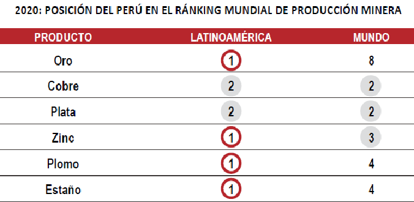
]

---
# Perú: reservas mineras

.center[
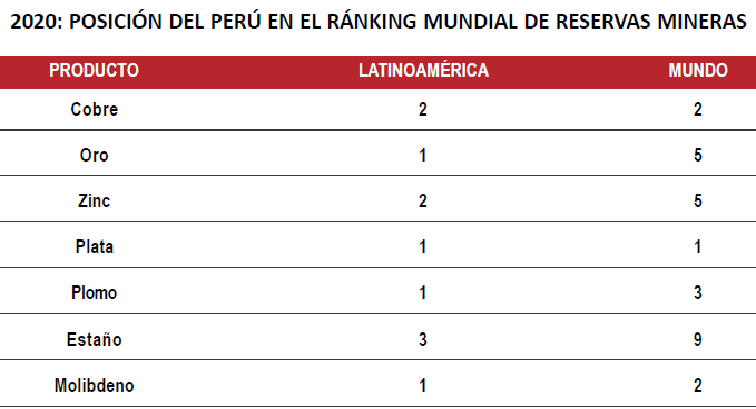
]
---
# Perú: producción y reservas Cu

.center[
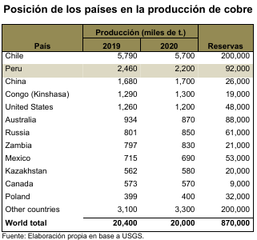
]

---
# Ranking mundial productoras Cu

.center[
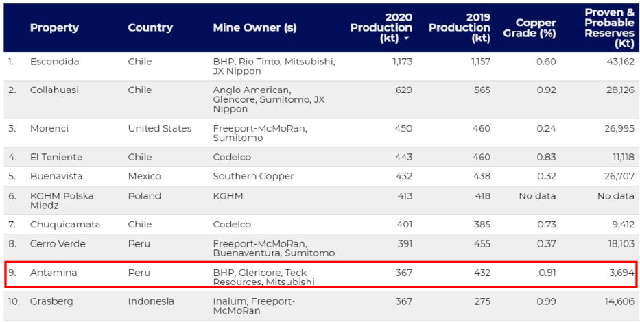
]

---
# La minería en la economía peruana

.center[
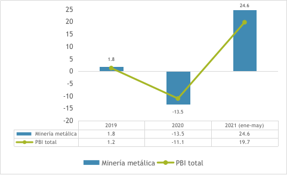
]

---
# Estructura exportaciones

.center[
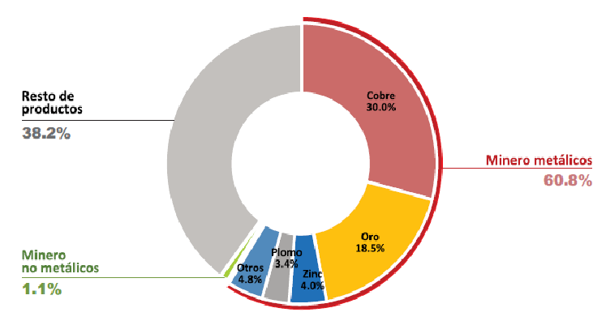
]

---
# Desempeño de Antamina

.center[
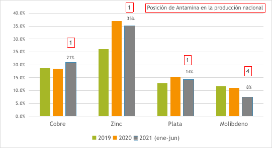
]

---
# Evolución Cu Zn

.center[
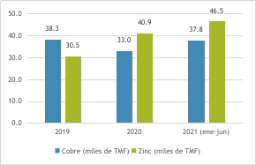
]

---
# Evolución Ag y Mo

.center[
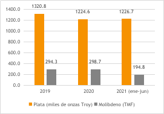
]

---
# Informe de BHP 2021

.center[
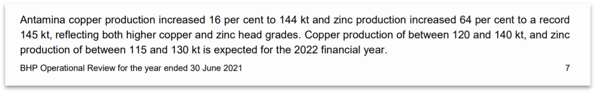
]

---
# Perspectivas a 2024, Cu y Zn

.center[
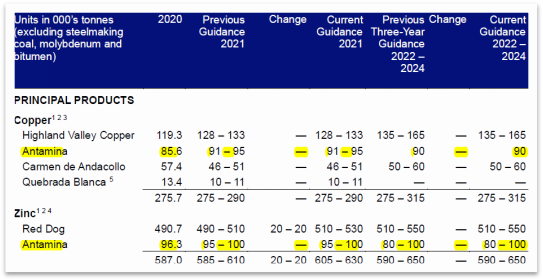
]

---
# Cotización Cu, Zn, AG y Mo 2019 - 2021

.center[
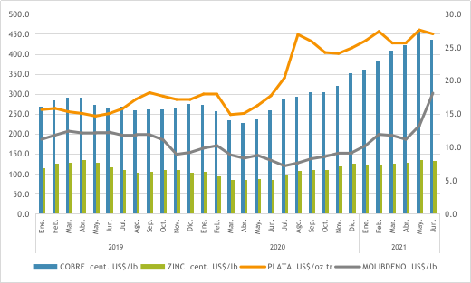
]

---
# Mineras exportadoras importantes

.center[
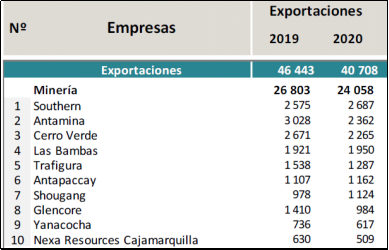
]

---
# Principales compradores de Antamina

.center[
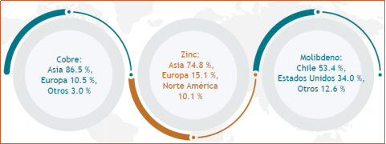
]

---
# Inversiones 

.center[
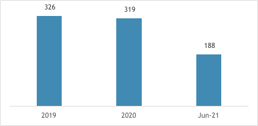
]

---
# Estados financieros

## Ingresos, ventasy rentabilidad

.center[
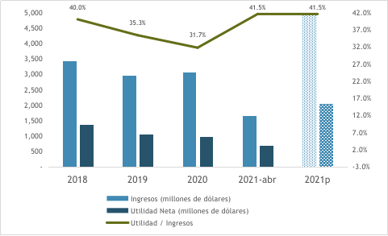
]

---
# Rentabilidad patrimonial

.center[
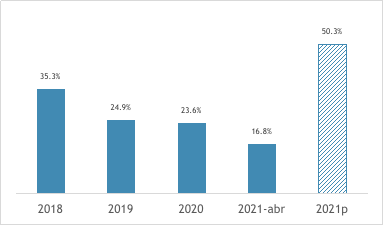
]

---
# Liquidez corriente

.center[
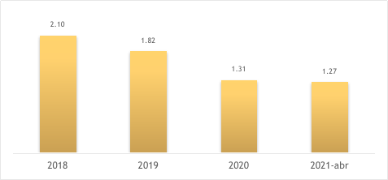
]

---
# Ingresos y utilidades por mineral

.center[
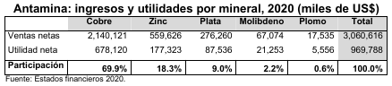
]

---
# Costo ventas y costo producción

.center[
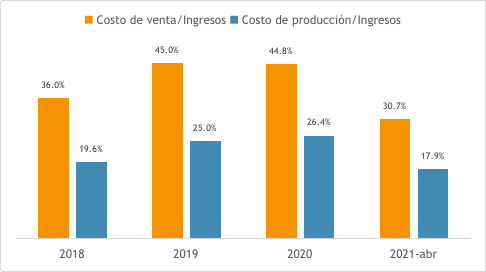
]

---
# Margen EBITDA

.center[
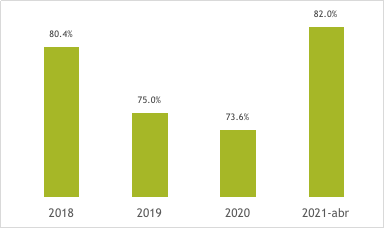
]

---
# Gasto de personal e ingresos

.center[
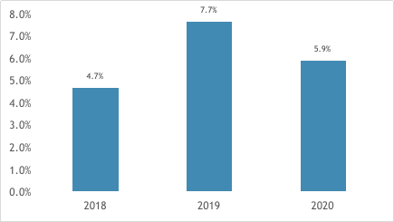
]

---
# Costo planilla promedio por trabajador

.center[
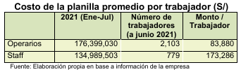
]
---
# Incremento nominal vs. real

.center[
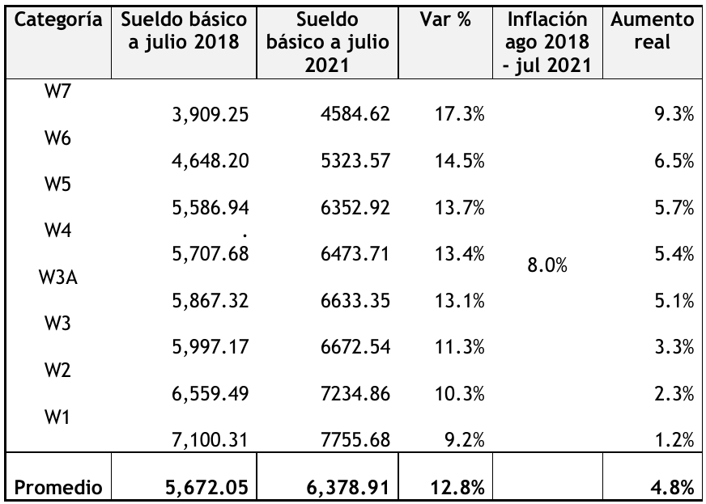
]

---
# Capacidad adquisitiva Ago 2018 - Jul 2021

.center[
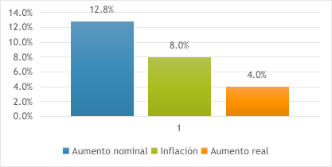
]
---
# Perspectivas internacionales
### Producción mundial de Cu

.center[
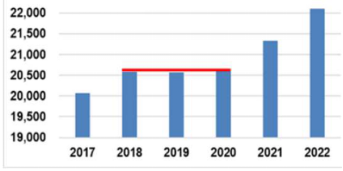
]

---
# Evolución y expectativa precios Cu

.center[
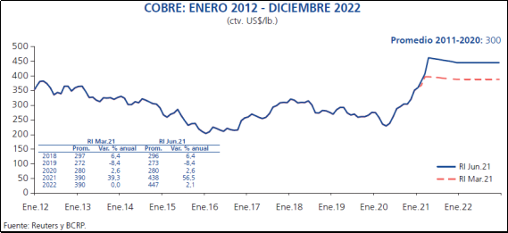
]

---
# Evolución y expectativa precios Zn
.center[
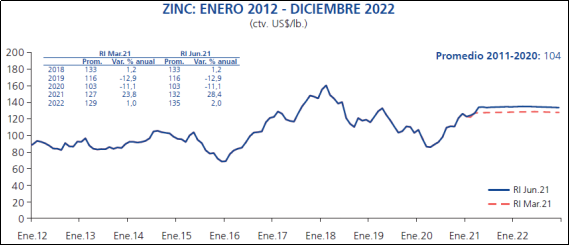
]

---
# Valorización del proyecto de convenio colectivo

.center[
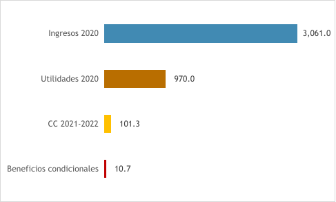
]

---
# Valorización del proyecto por beneficio

.center[
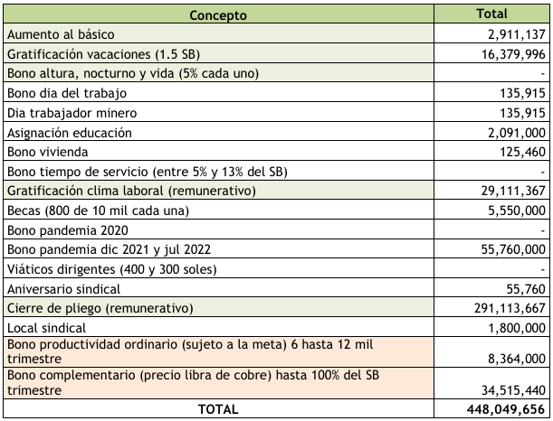
]
---
# Comparación

.center[
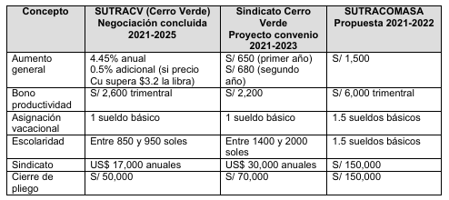
]

---
class: inverse, center, middle

# ¡Gracias!

