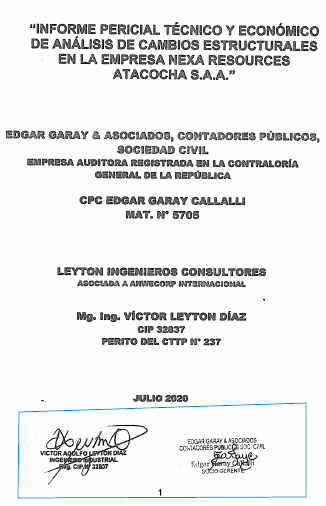

```{r, echo=FALSE}
xaringanExtra::use_webcam()
```

class: animated, fadeIn

# ¿Qué es lo que sostiene la empresa?

1. Causas objetivas alegadas:

  1. económica **Y** 
  
  2. estructural: .red[**AMBAS.**]

1. Presenta copia del Informe Pericial con firmas manuscritas:

  - 2 firmas en la carátula; y,
  
  - esas mismas 2 firmas en la última hoja del Anexo 4 del IP.
  
1. Dice que los motivos "económicos estructurales" están acreditados en el IP.

1. Presenta --fuera del IP-- 4 cuadros Excel.

---
class: animated, fadeIn

# Pero ...

+ .red[**Si 2 causales**], entonces, se necesita .red[**2 fundamentaciones**], diferentes, suficientemente identificadas.

+ Pero:

  1. El IP .red[**no distingue las 2 causales].** Más claro: .red[**EL IP NO CONTIENE 2 CAUSALES**].
  
  1. Un ingeniero no puede sustentar lo económico (no es su expertise).
  
  1. Un contador no puede sustentar lo estructural (no es su expertise).
  
  1. El IP no aparece lo suficientemente respaldado por los nominados profesionales. Sus firmas están, fácticamente, fuera de los límites del IP en sí. 
  
  1. Los 4 cuadros Excel no están insertos en el IP. Son piezas sueltas no justificadas en la causal alegada.

---

.center[]


---

background-image: url(img/caratulaIP.png)
background-position: center
background-size: contain, 50% 50%, cover

---


# Causalidad mental

Juan levanta el brazo porque se han producido múltiples descargas en su cerebro.

Juan levanta el brazo porque está saludando. 

Porque pide auxilio.

Porque está espantando una mosca.

¿Cuál es su intención?

Las razones de una acción son su causa. La que aparece como racional en la situación dada.

Causa - efecto | Motivo - acto | Motivo antisindical - despido

---
class: animated, center, middle

```{r, echo=FALSE}
# remotes::install_github("gadenbuie/countdown")
countdown::countdown(minutes = 0, seconds = 42)
```

---
class: inverse, center, middle, animated, bounceInDown
# ¡Gracias!