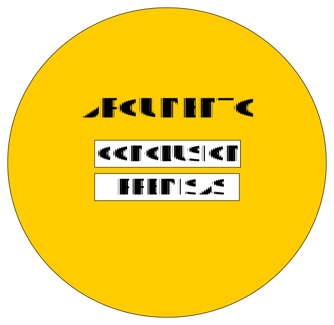
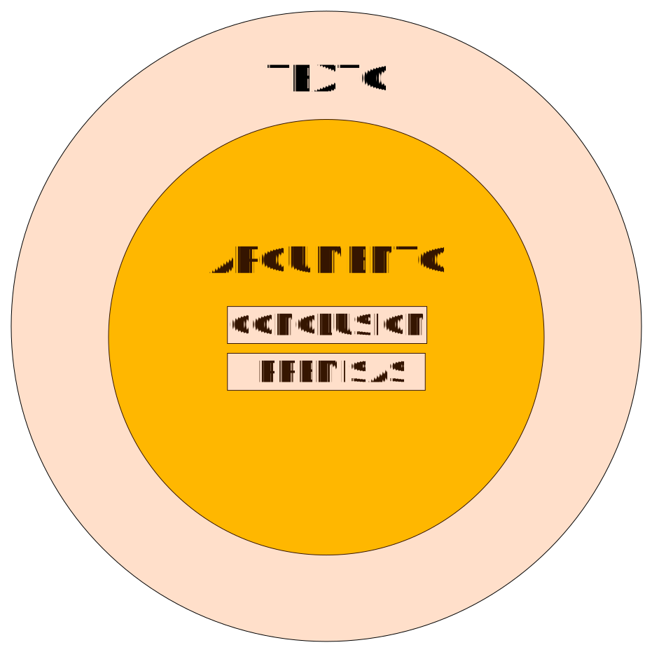
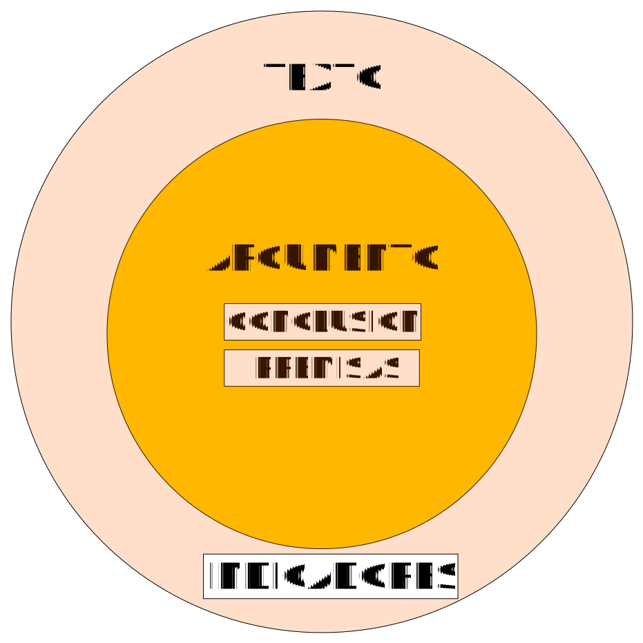
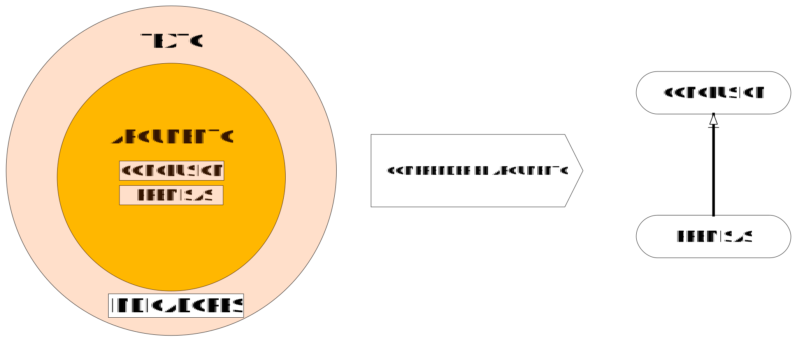
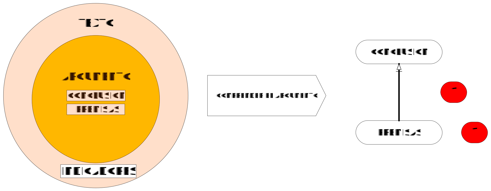
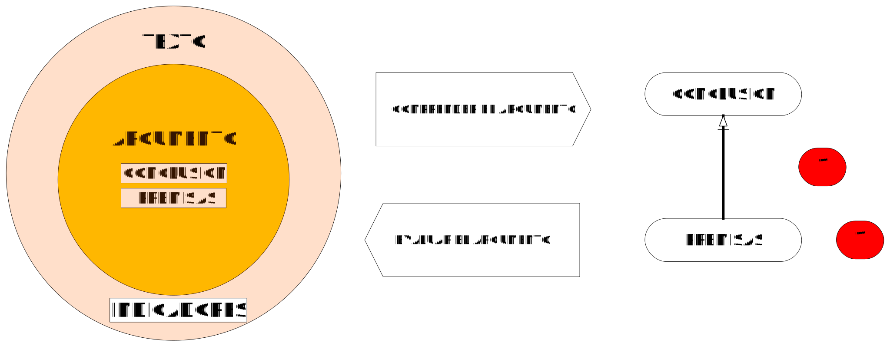

class: center, middle, animated, slideInRight

```{r setup, include=FALSE}
options(htmltools.dir.version = FALSE)
```

```{r xaringan-themer, include=FALSE, warning=FALSE}
library(xaringanthemer)
style_duo_accent(
  primary_color = "#2C2F4D",
  secondary_color = "#F97B64",
  inverse_header_color = "#FFFFFF"
)
```

```{r, echo=FALSE}
xaringanExtra::use_webcam()
```

# .red[Técnicas] argumentativas

---
layout: true
class: animated, fadeIn

---
# .red[Plan de la ponencia]

.pull-right[
### 1. Argumentación en el Estado Constitucional de Derecho

### 2. Diagramas argumentativos

### 3. Evaluación de los argumentos
]

---
class: middle, center, inverse

# Empecemos

---
# Argumentación en el Estado Constitucional de Derecho


## Dimensiones de la argumentación

1. Estructural. Normativismo. (Formalismo)

2. Valorativa. Justicia. Derechos humanos

3. Finalista. Social.

---
# Argumentación en el Estado Constitucional de Derecho

1. Función del proceso

2. Rol de los jueces y los operadores de la justicia

---
class: middle, center, inverse

# ¿Qué es un diagrama argumentativo?

---
class: middle, center


---
class: middle, center


---
class: middle, center


---
class: middle, center


---
class: middle, center


---
class: middle, center


---
class: middle, center


---

# Análisis de un caso

## Formule un diagrama argumentativo

**Décimo Segundo:** Tal como se ha descrito, la litis ha discurrido respecto a la reposición por un despido incausado, al haberlo así propuesto el actor en su escrito de demanda, mas no, la desnaturalización de los contratos, lo que no importó que se ejerza también la defensa en dicho sentido, lo que conlleva a establecer que al haberse sentenciado, y otorgado el derecho por una pretensión no postulada, como es el caso de la desnaturalización de los contratos, se ha violentado el principio de congruencia procesal y por ende el debido proceso. 


???

1. Una propuesta de solución

+ Las oraciones y las proposiciones en el derecho

+ Las oraciones: conjunto de símbolos lingüísticos con sentido completo:
  + [ ] UNMSM
  + [ ] deseoso Lima estaba fruta aromática en otro
  + [ ] La Ciudad Blanca es la capital de Perú

2. Una propuesta de solución

+ Es usual distinguir entre oraciones asertivas (descriptivas::proposiciones) (V/F) y oraciones directivas (prescriptivas::normas) (Jus/Inj; Vál/Inv; Efi/Inef)

  + [ ] Juan trabaja en el Poder Judicial
  + [ ] María es mayor de edad
  + [ ] Está prohibido fumar en clase
  + [ ] Quien por dolo causa un daño a otro está obligado a repararlo

3. Una propuesta de solución

Las proposiciones son el significado expresado por las oraciones asertivas

  + María tiene 25 años de edad.
  + La edad de María es de 25 años.
  + Hace 25 años nació María.
  + María le lleva 3 años a su hermano Jorge quien ya tiene 22 años cumplidos.
  + No veo a María desde que cumplió 20 años. Han pasado 5 años desde ese entonces.

+ Varias oraciones asertivas pueden expresar la misma proposición

+ Los razonamientos se dan entre las proposiciones.

  =

+ Las premisas de los razonamientos son proposiciones y de estas se infiere otra proposición que es la conclusión.

+ Las premisas y conclusiones permiten construir cadenas argumentativas, conformadas por proposiciones.

---

# Una propuesta de solución (1)

+ Una conclusión (también) no es sino una proposición derivada de una cadena argumentativa (los razonamientos) integrada por una serie de proposiciones.

+ Esa conclusión podría ser el petitorio o la pretensión.

---
class: inverse, center, middle

# Una cadena de proposiciones que deriva **en** la pretensión explícita.

---
class: animated, slideInRight


---
class: inverse, center, middle

# Diagramas argumentativos

---
# Elaborar un diagrama argumentativo

1. Rectángulos/Cajas y flechas

2. Proposiciones premisas

3. Proposiciones conclusión

4. ¿Cómo se conectan?

---
# Estructura

1. Reconocer las premisas y las conclusiones a partir de indicadores

2. Indicadores: palabras y frases

3. Para identificar:

  + Premisas y conclusiones
  + Argumentos vinculados
  + Argumentos convergentes
  + Cadena de argumentos
  + Argumentos complejos

---
# Interpretar argumentos

## ¿Qué va en los rectángulos y cuál es la dirección de las flechas?

1. Principios de equidad (lealtad) y caridad

2. Premisas implícitas (entimema)

3. Premisas de objeción y refutación (de la objeción)

---
# Vocabulario

1. Proposiciones o afirmaciones

Es una frase u oración que puede ser Verdadera o Falsa. Tienen un valor de verdad.

2. Proposiciones condicionales

Tienen 2 partes: el antecedente y el consecuente.

"Si (el antecedente), entonces (el consecuente)".

---
# Vocabulario

3. Argumento: Conjunto de proposiciones donde una es la conclusión y las otras las premisas que apoyan la conclusión.

Los argumentos pueden ser buenos, fuertes o incorrectos, débiles, pobres

4. La sintaxis del castellano

5. La semántica: el significado, la interpretación, de una palabra, un signo, una proposición

---
# Indicadores

## Introducen las premisas, los datos


+ Puesto que
+ Porque
+ De hecho
+ En efecto
+ Dado que
+ Luego
+ Ya que
+ También porque
+ Considerando que
+ Partiendo del hecho que
+ Eso es porque

---
# Indicadores

## Introducen la conclusión

+ Por consiguiente
+ Así pues
+ Por tanto
+ Por lo tanto
+ Si ... entonces

---
# Indicadores

## Introducen la regla general

+ A partir de ...
+ Dado que ...
+ Y eso porque ...
+ Dice que ...

---
# Indicadores

## Introducen la modalidad

+ Quizá
+ Probablemente
+ Es probable que
+ Necesariamente

---
# Indicadores

## Introducen la fuente, la autoridad

+ Como dice ..
+ Según ...

---
# Indicadores

## Introducen una reserva

+ A no ser que
+ Salvo que
+ A menos que
+ Excepto que
+ Aunque

---
# Indicadores

## Introducen un refuerzo para la justificación

+  Sin contar con
+ Si se tiene en cuenta el hecho de que
+ Observemos que
+ No obstante
+ A pesar de que
+ Si bien
+ Aunque

---
# Indicadores

## Introducen una objeción, un contraargumento

+ Sin embargo
+ No obstante que
+ A pesar de que

---
# Formule un diagrama argumentativo del siguiente caso

Juan tiene en su contrato de trabajo una cláusula en la cual se indica que el empleador se compromete a brindar todas las facilidades que resulten necesarias para la adecuada prestación del servicio, incluyendo facilidades para el traslado a su centro de trabajo. Juan se acaba de comprar un automóvil último modelo. Juan piensa que su empleador debe darle un espacio para estacionar su moderno vehículo o, en todo caso, pagarle la cochera. Su empleador le acaba de responder que "ni hablar, de ninguna manera".

Juan piensa interponer una demanda requiriendo a su empleador 1. la asignación de una plaza en la playa de estacionamiento de la empresa o, alternativamente, asuma el costo del estacionamiento en una playa comercial cercana al lugar de trabajo. Asimismo, ha demandado el monto pagado por estacionamiento desde la fecha del reclamo a su empleador.

***

Grupos par: Formule los argumentos a favor de la demanda de Juan

Grupos impar: Formule los argumentos en contra de la demanda de Juan 

---
class: inverse, center, middle

# ¡Gracias!

> # *pgparede@pucp.pe*