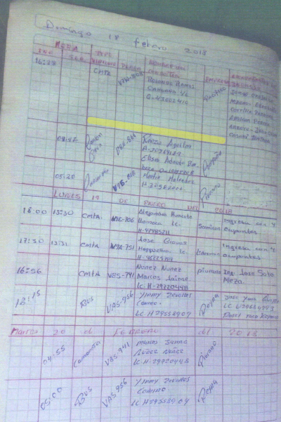
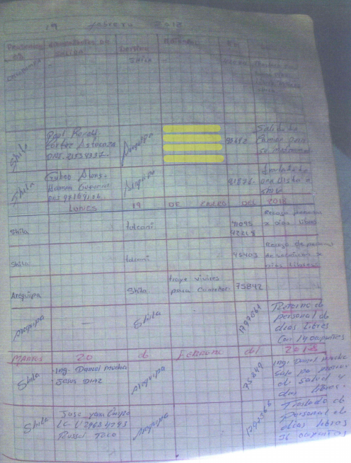
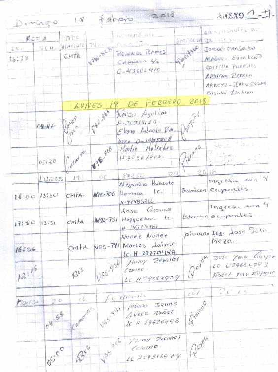
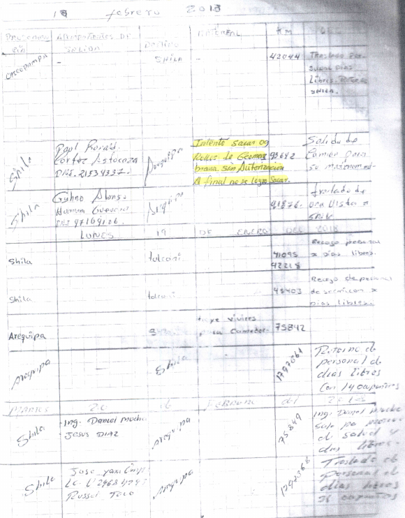

```{r, echo=FALSE}
xaringanExtra::use_webcam()
```

class: center, middle

# Anexo 2-A: 

# Escrito 2, demandantes, 04 junio 2018

---
class: center

 

---
class: center, middle

# Anexo 1-H: 

# Escrito contestación de demanda, 15 agosto 2019

---
class: center

 

---
class: center, middle

# Gracias
