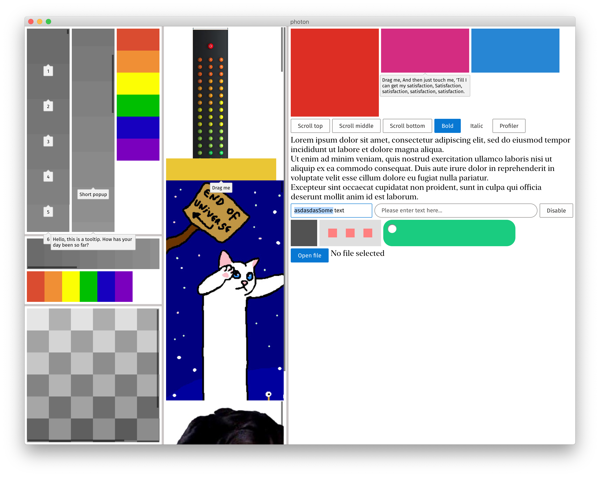

# Efficient cross-platform incremental UIs with Noria

Noria is a UI library for building lightweight, responsive, cross-platform UIs. Few key points:

- Targeting desktops, no mobile/web targets.
- Usable from Java/Kotlin, extensible via Kotlin.
- Lightweight, not based on Electron.
- Consistent cross-platform look and feel. No native widgets.
- Rendering via Rust and OpenGL.
- Flutter/Subform inspired layout model.
- Efficient incremental reconciler.

## Documentation

- [Building your first Noria application](docs/hello_world.md)
- [Incremental computations](docs/incremental_clojure.md)

## Checking Noria out

Prerequisites: Java 12, Maven, Cargo

```sh
git clone https://github.com/JetBrains/noria-clj.git
cd noria-clj/ui
./script/rebuild && ./script/run
```

This is what you should see:


