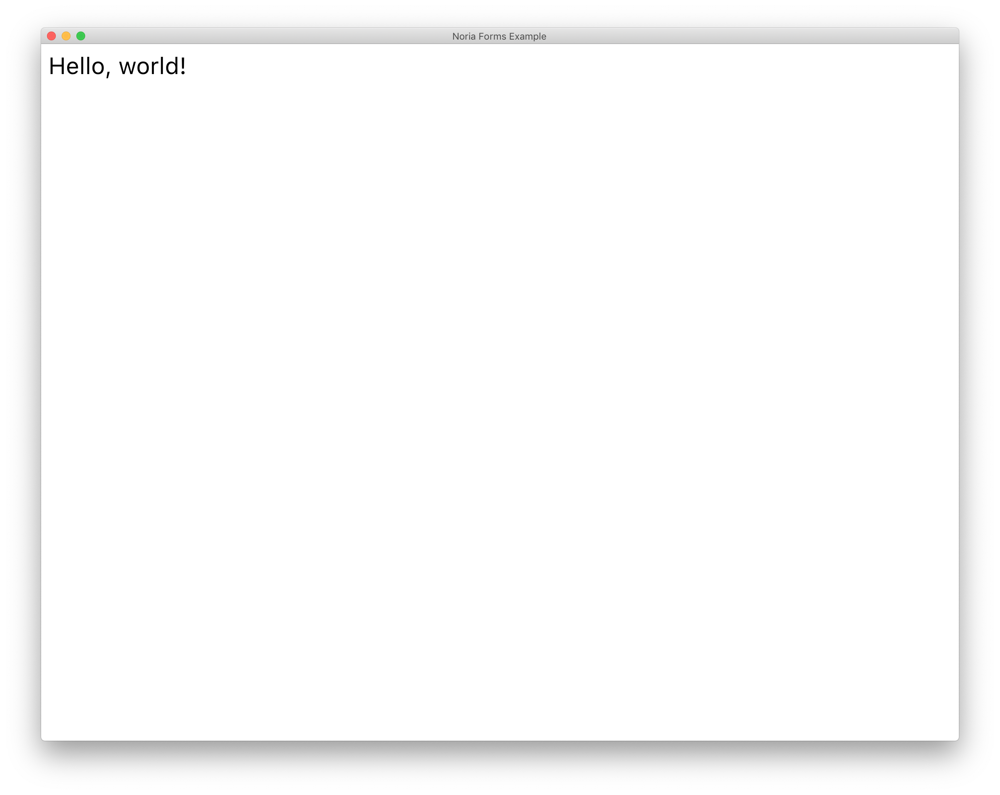
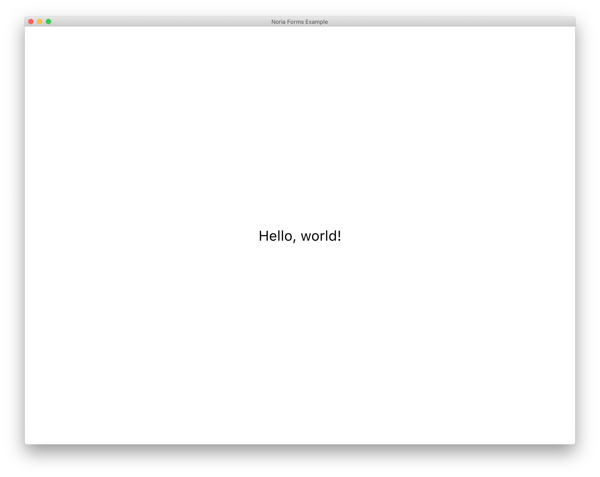
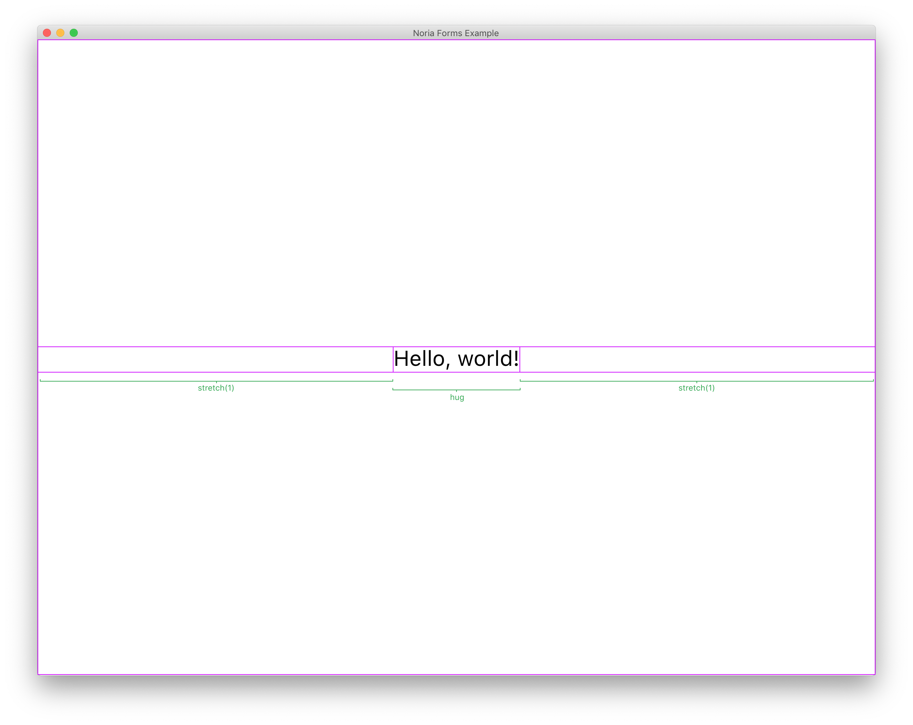

# Building your first Noria app

Let’s create a simple window with a label in Noria.

You can follow this example at [ui/src/examples/Hello.kt](../ui/src/examples/Hello.kt). To run it:

```
./ui/script/run noria.examples.hello.HelloKt
```

## Project configuration

Add `org.jetbrains.noria/noria-ui` version `0.1-SNAPSHOT` to your dependencies.

## Scaffolding

First, some infrastructure to run our app.

We’ll need a few vars to keep track of some state. For incremenal computing engine:

```kotlin
var noriaRef: Noria<Unit>? = null
```

For current window size:

```kotlin
var windowSize = Size(1250.0f, 950.0f)
```

Noria is multi-window and you are responsible for allocating window ids. You can use any longs, we’ll use 1729 in our case:

```kotlin
val windowId = 1729L
```

Noria is a dependency graph of computations and their cached results. Each computation is identified by Noria-allocated `nodeId` (== long). When Noria widgets want to “force update” some nodes they will call a user-provided callback, `StateUpdater`. StateUpdater is just `(nodeId: Long, transform: (Any?) -> Any?) -> Unit`. Your task it to decide what to when such update is triggered. Simplest strategy would be to render immediately:

```kotlin
val updater = StateUpdater { nodeId, transform ->
  // trigger cascade updates and redraws starting from dirtySet
  val dirtySet = mapOf(nodeId to Function { transform.apply(it) })
  noriaRef!!.update(dirtySet)
  // tell Scene we are finished and it could send frame for rendering
  val scene = noriaRef!!.dag.rootBindings.get(SceneKey) as Scene
  scene.commit()
}
```

More advanced strategy would be to buffer updates for e.g. 2ms in case something else would change, and then batch apply accumulated dirtySet (see `markDirty`).

Ok, now to the actually creating an UI window and Noria instance. This has to be done in a separate thread because we’ll need main thread for event dispath later.

```kotlin
Thread {
  val scene: Scene = PhotonApi.createWindow(windowId, windowSize, "Noria Forms Example")
  val rootBindings: Map<Any, Any> = eventsBindings() + mapOf(SceneKey to scene, NoriaRT.UPDATER_KEY to updater)
  noriaRef = noria(rootBindings) {
    renderRoot(currentFrame, windowSize, app())
  }
  scene.commit()
}.start()
```

Last thing we should do before we can run our app is to process events. In its simplest form it’ll look like this:

```kotlin
PhotonApi.runEventLoop { events ->
  events.forEach { e ->
    if (noriaRef != null)
      handleUserEvent(noriaRef!!.dag, e)
  }
}
```

## Hello, world!

Now we need an app to draw! Let’s make a simple Hello, World window:

```kotlin
fun Frame.app(): TRenderObject {
  val label = expr { Text("Hello, world!", Color.css("000000"), FontSpec("UI", 32), PhotonApi.Wrap.WORDS) }
  return expr { padding(label, 10f, 10f, 10f, 10f) }
}
```

Now if you run your program you should see something like this:



Few things need explanation though.

Function has `Frame.` receiver. This is required for `expr`s to work. Don’t worry about creating it though: `noria()` call will create one for you, and each nested `expr` call defines new one too.
 
`expr` is Noria’s way to mark a boundary of incremental computation node. Every `RenderObject` constructor should be wrapped in one.

`Text` is our first `RenderObject`! What it does it that it renders paragraph of text, trying to fit it into given constraints. Also notice that we are using `"UI"` font family with default weight and size 32. This is a built-in font Noria uses to render all its widgets.

`Padding` is another RenderObject. What it does it adds padding around its content. Notice that it takes TRenderObject (== `expr { RenderObject }`) as its argument and then it is itself wrapped in `expr`.

## Layouts

This is all cool and dandy, but let’s center our label! For this we’ll something more advanced: boxes!

```kotlin
fun Frame.app(): TRenderObject {
  val label = expr { Text("Hello, world!", Color.css("000000"), FontSpec("UI", 32), PhotonApi.Wrap.WORDS) }
  val row = expr { hbox(listOf(expr { Nil() } to Dimension.stretch(1f),
                               label to Dimension.hug,
                               expr { Nil() } to Dimension.stretch(1f))) }
  val column = expr { vbox(listOf(expr { Nil() } to Dimension.stretch(1f),
                                  row to Dimension.hug,
                                  expr { Nil() } to Dimension.stretch(1f))) }
  return column
}
```

This is what you should see:



So, what’s going on? Well, we are first centering our label horizontally and then centering the resulting row vertically. Noria uses layout model similar to Flexbox and [Subform Layout](https://github.com/lynaghk/subform-layout). `Dimension.hug` means “take as much space as your child is taking”, and `Dimension.stretch(1f)` means “distribute the leftover space proportional to stretch values”. In our case left stretch == right stretch == 1f, so the content in the middle will have equal amout of space to the left and to the right, or, in other words, centered. Same then repeated with vbox but in vertical direction.



`expr { Nil() }` is a special marker component that does not render itselt. Unfortunately you can’t simply create it once, save it to variable and reuse. You need to create a separate one for each time you use it. This is actually the same with any `expr`s: they must be placed inline in your code and can’t be moved inside any function.

## Events

You might noticed that our app does not respond to window resize. This is easy to fix:

```kotlin
PhotonApi.runEventLoop { events ->
  events.forEach { e ->
    if (noriaRef != null) {
      when (e) {
        is WindowResize -> {
          windowSize = e.size
          updater.accept(noriaRef!!.dag.root, Identity)
        }
      }
      handleUserEvent(noriaRef!!.dag, e)
    }
  }
}
```

Here we are forcing Noria to invalidate root node, leading to updated redrawing the whole app top-down. Don’t worry, only components that directly or indirectly depend on window size will be redrawn, for the rest Noria cache will kick in. This will happen automatically by tracking expr dependencies, no need to configure anything or write `shouldComponentUpdate` manually.

You may also noticed that our window does not react to the close command. That’s because we haven’t taught it so! Change:

```kotlin
PhotonApi.runEventLoop { events ->
  events.forEach { e ->
    if (noriaRef != null) {
      when (e) {
        is WindowResize -> {
          windowSize = e.size
          updater.accept(noriaRef!!.dag.root, Identity)
        }

        is CloseRequest -> {
          PhotonApi.stopApplication()
          return@forEach
        }
        
        is KeyboardInput ->
          if (e.keyCode == VirtualKeyCode.Q && e.modifiers.cmd) {
            PhotonApi.stopApplication()
            return@forEach
          }
      }
      handleUserEvent(noriaRef!!.dag, e)
    }
  }
}
```

And you should be able to close window with red dot or by pressing `Cmd + Q`.