class: center, middle, animated, slideInRight

```{r setup, include=FALSE}
options(htmltools.dir.version = FALSE)
```

```{r xaringan-themer, include=FALSE, warning=FALSE}
library(xaringanthemer)
style_duo_accent(
  primary_color = "#1F1D2B",
  secondary_color = "#F97B64",
  inverse_header_color = "#FFFFFF"
)
```

```{r, echo=FALSE}
xaringanExtra::use_webcam()
```

# Recurso de revisión

## RDR 009-2022-GRL

## Comunicación de cese colectivo de 212 trabajadores

---
layout: true
class: animated, fadeIn

---
# 1. Reconsideración ¿es procedente?

.pull-left[

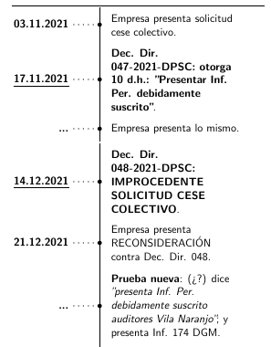

]

.pull-right[

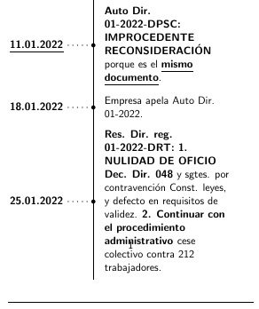

]

---
## 2. ¿El Inf. Per. está debidamente suscrito?

#### Presentación del informe

.center[

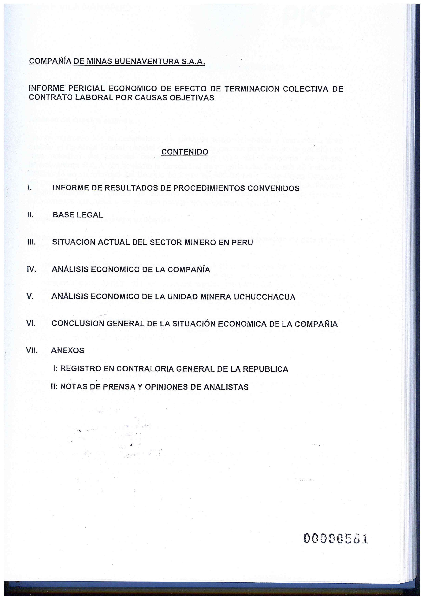

]

---

.pull-left[


]


.pull-right[

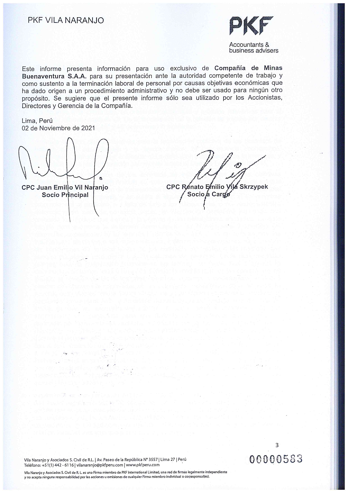

]

---
### El informe

.pull-left[


]

.pull-right[

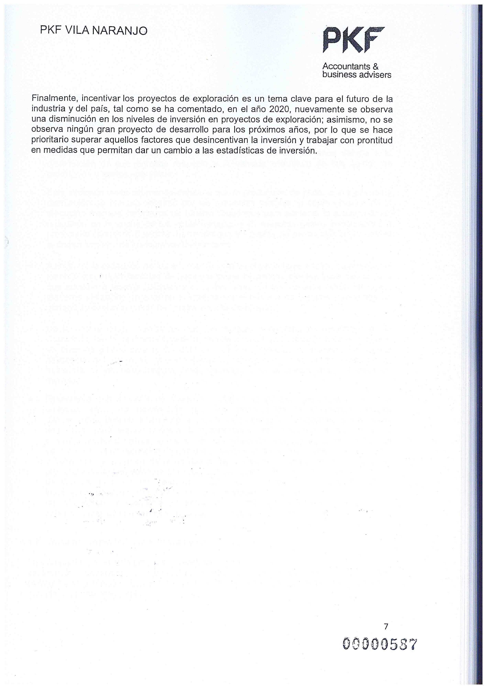
]

---
### El informe

.pull-left[


]

.pull-right[


]

---
### El informe

.center[

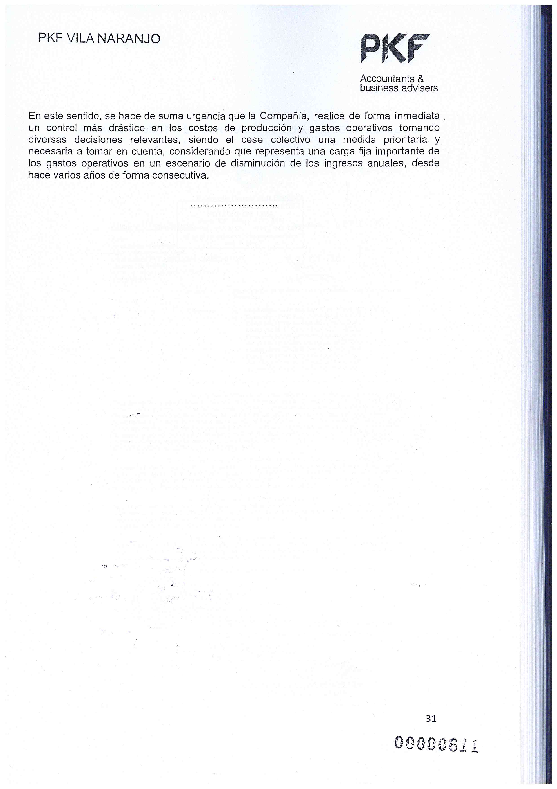

]

---

## 3. Lo presentado en preadministrativo

### Carta invitación 15 de octubre 2021

.pull-left[

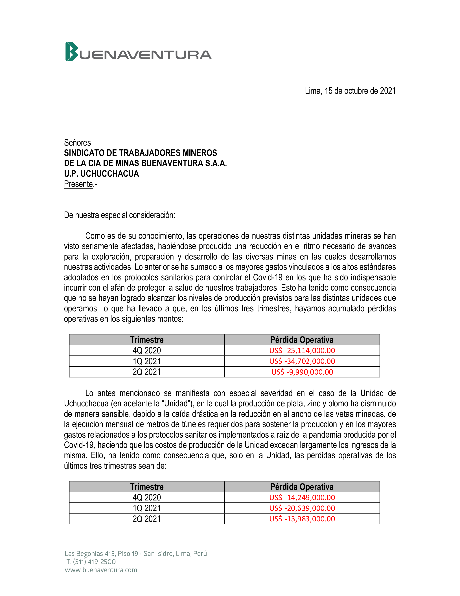

]

.pull-right[

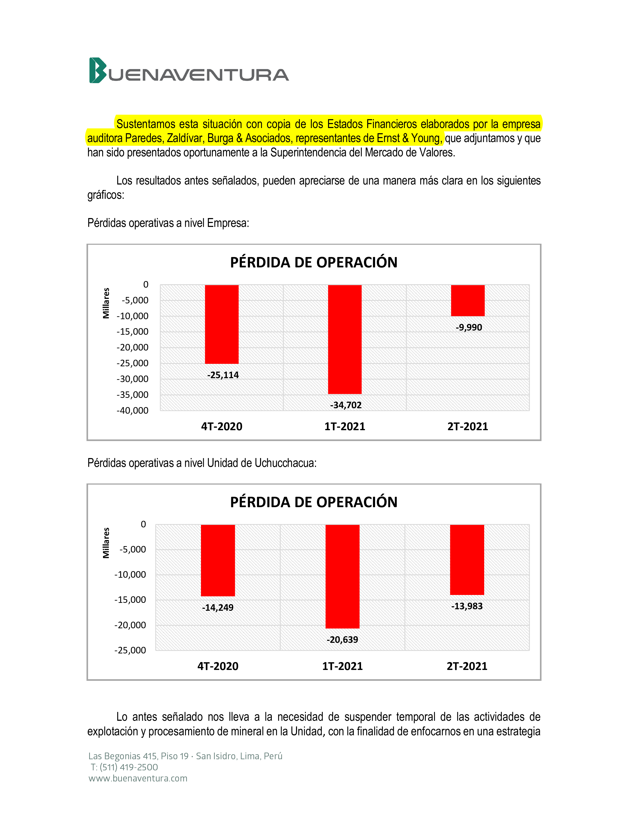
]

---
### Carta invitación 15 de octubre 2021

.center[


]

---

## 4. La empresa no ha presentado la información solicitada

--

## 5. La falta de información incide en una negociación real de buena fe

---

## 6. No ha habido negociación colectiva

### Acta sindicato empleados


.pull-left[

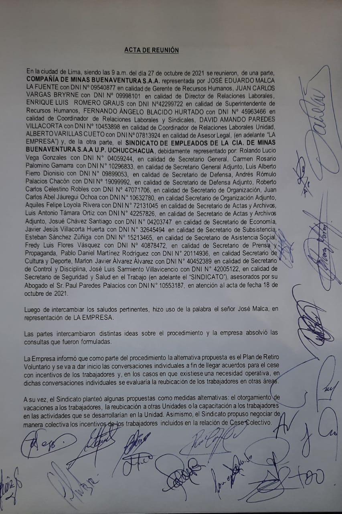

]

.pull-right[

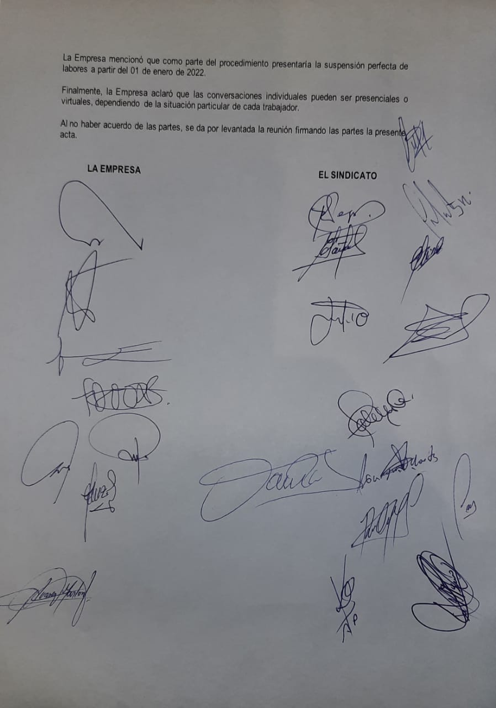
]

---
### Acta sindicato obreros


.pull-left[


]

.pull-right[

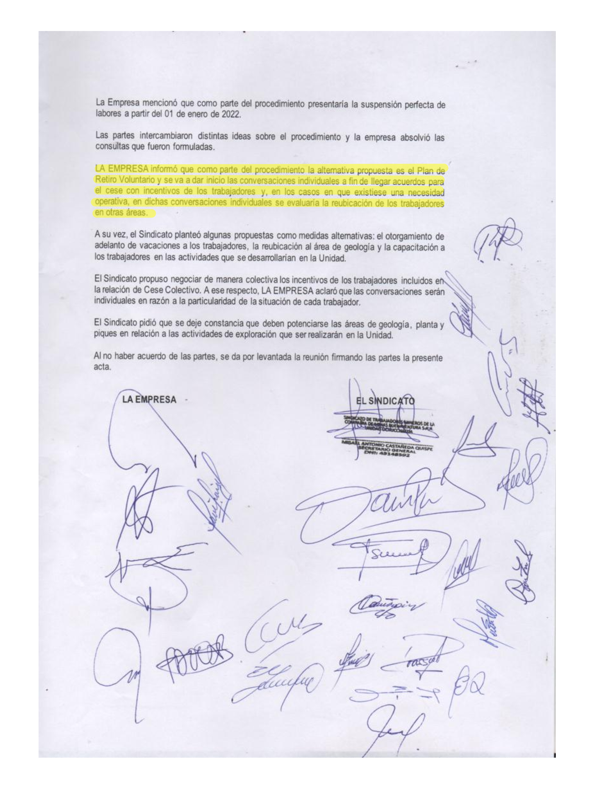
]

---
### Acta sindicato obreros

.center[


]

---

## 7. Vulneración derechos fundamentales


|  | Número dirigentes | En lista cese colectivo |
|--|:----------------------|:------------------------|
| Sindicato Obreros | 20| 19 + 1 |
| Sindicato Empleados | 15 | 10 |
| Comité SST | ... | 5 |
| Grupo vulnerable Covid | ... | 13 |
| Discapacidad | ... | 8 |
| Maternidad | ... | 1 |

---

## 8. No cumple el mínimo del 10% del total del personal de la empresa

### Línea del tiempo

.pull-left[

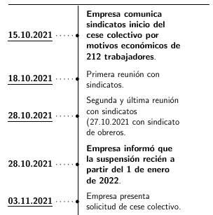

]

.pull-right[

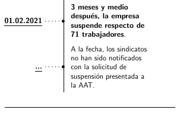

]

---
class: center, middle

|   | Obreros | Empleados | Totales |
|---|---------|-----------|---------|
| Mutuo disenso | 40 | 31 | 71 |
| Mismo puesto | 29 | 13 | 42 |
| Dif. puesto | 5 | 7 | 12 |
| Subtotales | 74 | 51 | 125 |

---
class: center, middle

| Total | Obreros | Empleados |
|---|---------|-----------|
| 212 | 143 | 69 |
| -125 | -74 | -51 |
|------|-----|-----|
| 87 | 69 | 18 |

---
class: center, middle

| Suspensión | Obreros | Empleados | Total |
|---|---------|-----------|------|
|  | 56 | 15 | 71 |
|----|----|----|
| Indeterminado | | | 16 |
| | | | 87 |

---
class: center, middle

|    | Número de trabajadores | Porcentaje |
|----|------------------------|------------|
| Total personal empresa | 1,859 | 100% |
| Lista octubre 2021 | 212 | 11.40% |
| A febrero 2022 | 87 | 4.68% |

---
class: center, middle


