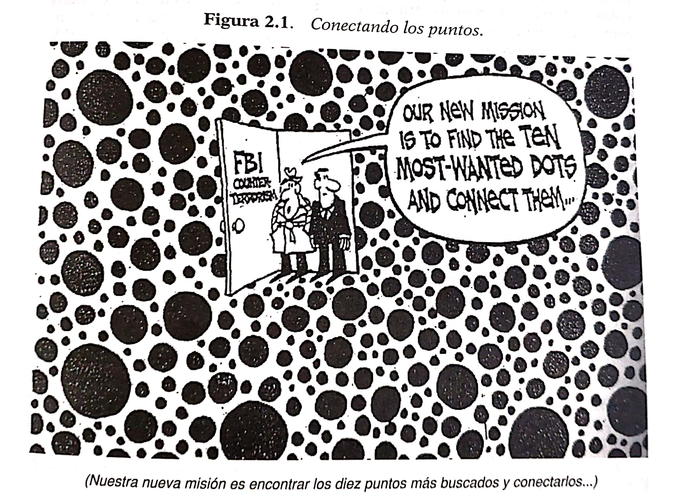

class: center, middle, animated, slideInRight, inverse

```{r setup, include=FALSE}
options(htmltools.dir.version = FALSE)
```

```{r xaringan-themer, include=FALSE, warning=FALSE}
library(xaringanthemer)
style_duo_accent(
  primary_color = "#2C2F4D",
  secondary_color = "#F97B64",
  inverse_header_color = "#FFFFFF"
)
```

```{r, echo=FALSE}
xaringanExtra::use_webcam()
```

# Empecemos

---
layout: true
class: animated, fadeIn

---
class: animated, fadeIn, inverse, center, middle

# Teoría del caso y técnicas de litigación oral

---
class: center, middle

# Analice el siguiente caso

---
class: center, middle

> ## Tres niños y una flauta

> ## Amartya Sen (2009), The idea of justice, The Belknap Press, pp. 12-15.

---
class: center, middle

> ## ¿A quién le entregaría usted la flauta y por qué?

> ## 1. Escriba una lista de las razones de hecho y de derecho en sustento de su respuesta

> ## 2. Exponga la justificación de su respuesta

---
class: center, middle

> # Identifique el caso: ¿qué ha necesitado para ello?

---
class: center, middle

> ## Usted ha necesitado dos cosas:

> ## 1. Una norma de derecho (reglas y principios)

> ## 2. Un conjunto de hechos que<br> "pertenecen" - "entran" - "encajan"<br> en la regla de derecho

---
class: animated, fadeIn, center, middle

> ## Diferencia entre "Teoría del caso" y "Técnicas de litigación oral"

> ## *"Theory of the case"* vs. *"Courtroom tactics"*

---
class: animated, fadeIn, center, middle

> ### *This conception of ‘theory’ serves the function of isolating that aspect of advocacy which is concerned with .red[rational arguments] from .red[other aspects], such as commanding attention, communication, questioning, persuasive presentation and various courtroom tactics. The conception is also analytically convenient in that it provides a clear connection with theories of legal reasoning.*

> ### William Twining (2006), *Rethinking evidence*, Cambridge University Press, p. 290.

---
class: animated, fadeIn, center, middle

> ### .red[La teoría del caso] es la afirmación lógica formulada como un argumento que apoya una o más conclusiones sobre el caso como un todo.

> ### Terence Anderson, David Schum, William Twining (2005), *Análisis de la prueba*, Marcial Pons, p. 160.

---
class: animated, fadeIn, middle

> ## Condiciones para una teoría del caso o,

dicho de otro modo,

> ## Condiciones para la aplicación de derecho que recoge la pretensión/defensa planteada

  > ### Interpretar la norma, en el supuesto de hecho y en la consecuencia

  > ### Identificar los problemas de prueba y los problemas de calificación

---
class: animated, fadeIn, middle

# Plantear el caso | Formular las pretensiones/defensas

> ### 1. Identificar la norma de derecho que resuelve el conflicto

> ### 2. Determinar los elementos del supuesto de hecho

> ### 2.1. Distribuir el riesgo procesal: .red[la carga de la prueba]

> ### 3. Relacionar la prueba con cada uno de los elementos

> ### 4. ---> plantear el caso

---
# Argumentación sobre hechos

## Tres (3) concepciones de la argumentación

### 1. .red[Concepción formal]: lógica deductiva: argumentar es deducir
  
### 2. .red[Concepción material]: conocimiento: *justified true believe*: epistemología, leyes científicas, máximas de la experiencia: argumentar es fundamentar
  
### 3. .red[Concepción pragmática]: dialéctica (justificar una decisión con base en razones) o retórica (persuasión actoral al auditorio): argumentar es convencer

---
# Argumetación sobre hechos

### Cuatro modos de debatir (Josep Aguiló)

|Tipo de debate | Modo de debatir | Metáfora | Finalidad | 
|:--------------:|:---------:|:--------:|:---------:|
|Disputa | Combatir | Bélica | Imponerse al otro |
|Controversia  |Competir  | Deportiva | Opinión prevaleciente |
|Diálogo racional |Explorar/diagnosticar | Médica/judicial | Resolver un problema |
|Consenso |Construir | Constructiva | Alcanzar un consenso |

> #### Josep Aguiló. El arte de la mediación. Argumentación, negociación y mediación. Editorial Trotta, Madrid, 2015, pp. 31-55.

---
class: center, middle 

# Razonamiento probatorio



---
class: center, middle, inverse

# Responsabilidad y procesos laborales

---
class: center, middle

# Primer elemento: la norma de derecho

---
class: center, middle

# Responsabilidad civil (*tort law*)

## ¿La responsabilidad *civil* (o el derecho de daños), en el ámbito laboral, tiene alguna particularidad? Si la tiene ¿en qué consistiría esta?

---

# Algunas consideraciones sobre la responsabilidad civil (*tort law*)

1. La idea del *ojo por ojo*: la ley del talión: "tal cual"

  + Código de Hammurabi, 1750 aC
  
  > 229 § Si un albañil hace una casa a un hombre y no consolida bien su obra y la casa que acaba de hacer se derrumba y mata al dueño de la casa, ese albañil será ejecutado.

2. La idea de personas con/sin dignidad

  + *Usatges de Barcelona*, CT 9, XXIX, 5 y 6
  
  > Por muerte de un campesino (rusticus interfectus), 6 onzas de oro
  
  > Personas que tenían dignidad (cives, burgensis, milites, etc.), 5 sueldos por un golpe en la cara; 20 sueldos si provocaba sangres; etc.

---

# Roma y la *Lex Aquilia*

1. Frente al daño se impone una pena pecuniaria 

2. O la entrega de la cosa/sujeto causante, al dañado

3. Finalidad de castigo; de satisfacción al dañado; no compensación

4. Importante en el derecho moderno: culpa, daño, relación causal

---

# Desarrollo e importancia de la responsabilidad

+ Responsabilidad por productos defectuosos

+ Responsabilidad de vecindad

+ Responsabilidad médica

+ Responsabilidad por accidentes de tránsito

+ **Responsabilidad derivada de los cambios tecnológicos**

---

# Responsabilidad por cambios tecnológicos

+ El ferrocarril, los vehículos autopropulsados

+ La caldera de vapor en el desarrollo industrial

+ El asbesto

+ Las *tecnologías disruptivas*
  + Automatización del trabajo
  + Internet de las Cosas
  + Robótica
  + Medicina regenerativa
  + Energías renovables
  + Plataformas digitales
  + Impresión 3D
  
---

# La caldera de vapor: impacto en la sociedad

1. La industrialización provocó que cientos, miles de obreros fallezcan o queden lesionados.

2. Los accidentes son tratados como meros infortunios, mala suerte, sin consecuencias hacia el empresario.

3. Trabajadores sin protección, salvo la beneficencia.

---

# La caldera de vapor: impacto a nivel jurídico

1. UK: doctrina de las *the three ugly sisters*: asunción del riesgo, culpa de la víctima, culpa del compañero.

2. FR, ES: regulación estatal sobre calderas

3. DE, FR: criterios más estrictos, por ley o por la jurisprudencia.

4. DE, UK, IT, FR, ES, fines s. XIX, leyes sobre accidentes de trabajo
  
---

# El asbesto: impacto en la sociedad y retos jurídicos

+ Las víctimas: el trabajador, su familia, terceros

+ Las enfermedades: asbestosis, cáncer, mesotelioma, placas pleurales

  1. Seguros
  2. Prohibición general
  3. Excede el ámbito laboral
  4. Largo periodo de latencia
     + Problemas de prescripción
     + De causalidad
     + De solvencia de los causantes (Fondos de compensación)
    
---

# Situación de la responsabilidad civil

+ Los códigos tradicionales no abordan los problemas de la vida moderna

+ Las regulaciones son muy dispares

+ Las leyes de accidentes de trabajo pueden resultar infrainclusivas respecto de la finalidad de compensación de la responsabilidad civil

+ Desarrollos a nivel de soft law

  + Restatement (Third) of Torts
     + Por productos
     + Por daño físico y emocional
     + Por daño económico
     + Por daño intencional a las personas, difamación y privacidad
    
  + PETL: Los principios europeos de responsabilidad civil (2005)
  
  + Marco común de referencia (Draft Common Frame of Reference)

---

# Dos perspectivas de la responsabilidad civil frente a los daños

1. "Tout pour la victime" o indemnización a toda costa

2. "Casum sentit dominus": el titular de un bien jurídico es quien soporta las consecuencias del daño que sufre; **salvo** que haya una razón para trasladar sus consecuencias a otra persona.

  + Principio de reparación integral
    + Reglas:
      + Acción/omisión
      + Daño
      + Relación de causalidad
      + Alcance de la responsabilidad
      + Título o fundamento de la RC: culpa, RO, por hecho ajeno
      
    + Indemnizar todo el daño: ni más, ni menos
    
    + Si no hay daño, no hay perjuicio indemnizable
    
---

# Mecanismos para enfrentar los daños

1. Responsabilidad civil (contractual, extracontractual)

2. Seguros

3. Sistemas de Seguridad Social

4. Fondos de Compensación


---

# La responsabilidad (civil) en el ámbito laboral

## 1. Enfoque clásico

## 2. Enfoque desde la justicia distributiva y la justicia correctiva

---

# 1. El enfoque clásico

- La responsabilidad es materia civil

- No hay razones para diferenciarlo con otros ámbitos

- Aplica subsidiariamente, en lo laboral, la dogmática civil clásica

- La responsabilidad se divide en:
  + Contractual
  + Extracontractual
  
- La responsabilidad en el ámbito laboral {despido, AT, EP} es (civil) contractual

**Por tanto:** se trata de verificar la presencia de los 4 elementos de la responsabilidad contractual:
  1. Conducta antijurídica (- incumplimiento de la ley, del contrato)
  2. Daño
  3. Nexo causalidad
  4. Factor de atribución: - Dolo, - Culpa inexcusable, o - Culpa leve

---

## 1. Conducta antijurídica

+ 1321: no ejecutar la obligación (por dolo, culpa inexcusable, culpa leve)

+ 1314: actuar con la diligencia ordinaria requerida

+ 1315: por tanto, si
  + inejecución
  + cumplimiento tardío o defectuoso
  + CF o FM: no hay responsabilidad
  
+ 1329: se presume la culpa leve
  + invierte. carga. probatoria: --> demandado: + probar diligencia ordinaria requerida (circunstancias de persona, tiempo y lugar)
  
---

## 2. Daño (y cuantía)

+ perjuicio en un interés legítimo

+ 1321:
  + daño emergente
  + lucro cesante

+ 1322:
  + daño moral

+ 1331: la prueba corresponde al DTE: el perjudicado por la
  + inejecución
  + cumplimiento parcial
  + cumplimiento tardío
  + cumplimiento defectuoso
  
+ 1332: si no prueba el monto preciso, el juez lo fija "con valoración equitativa"

---

## 3. Causalidad {fáctica, jurídica (qué consecuencias se reparan)}

+ 1321: DE; LC; DM que sean
  + consecuencia inmediata y directa de la inejecución y, además
  + [culpa inexcusable, dolo] todas esas consecuencias: previsibles (o no) al momento de la contratación
  + [culpa leve] solo el daño que podía preverse al tiempo en que la obligación fue contraída

---

## 4. Factor de atribución {dolo, culpa inexcusable, culpa leve}

+ 1329: se presume la culpa leve
  + inversión.carga.prueba: DDO --> prueba: diligencia ordinaria (estándar de diligencia: esfuerzos, prevenciones)
  
+ 1330: DTE --> prueba dolo, culpa inexcusable del DDO

---

## *. Defensas de fondo

+ 1326: concurrencia de culpa/dolo de la víctima
  + reducción del resarcimiento; porque hay corresponsabilidad (cocausación)

+ 1327: liberación de resarimiento por daños que el acreedor habría podido evitar usando su diligencia ordinaria

+ 1315: CF / FM:  causa no imputable, consistente en un evento extraordinario (que sale de lo común, que no es usual), imprevisible (no se podía prever al tiempo de contraer la obligación (según lo debido)) e irresistible (al momento de cumplirla), que impide la ejecución de la obligación o determina su cumplimiento parcial, tardío o defectuoso.

+ 1328*: nulidad de los pactos de exoneración y limitación de responsabilidad

---

# 2. El enfoque desde la justicia distributiva y la justicia correctiva

- Tendencia a la unificación de los sistemas de responsabilidad

- Se habla de responsabilidad civil vs. responsabilidad penal, pero abarca muchos campos, incluido el laboral

- La unificación significa que los linderos de la responsabilidad contractual vs. la extracontractual se difuminan

- No se reconoce que hay diferencia entre que haya, o no, un contrato de por medio, pero ya no es un criterio de separación entre "sistemas".

- P. ej. el CCyC argentino de 2014

- O "Los principios de derecho europeo de la responsabilidad civil", Viena 2005

- Se habla de derecho de daños, *tort law*

---

# John Rawls

- En sociedades liberales el Estado debe garantizar a los individuos un conjunto de bienes, derechos:: bienes primarios:: propiedad privada - integridad física

- Bienes útiles para desarrollar un plan de vida del cual soy responsable

- En el mundo real hay hechos, interacciones, que alteran los planes de vida por circunstancias ajenas a la voluntad de la persona: hechos naturales; de otros: (terceros, contraparte)

Naturaleza
:: - El Estado interviene neutralizando el infortunio (esquemas de compensación social, castigo al dañador)
:: - El sujeto asume el infortunio

Acción de terceros
:: - Posibilidad de dañarse mutuamente
:: - Posibilidad de causar pérdidas de uno a otro

Estado reconoce
:: Derechos de indemnidad (libre de interferencias)
:: Deberes de indemnidad (deber de no dañar)

Reglas sustantivas de responsabilidad
:: Derecho a no ser dañado
:: Deber de no dañar a los otros || --> Incide en: Libertad y seguridad personal
Sirven como criterios de distribución

---

# Los derechos de indemnidad

Son bienes primarios que se distribuyen entre los miembros de una comunidad

- Derechos y deberes primarios, de indemnidad: justicia distributiva

- Derechos y deberes secundarios, de compensación: justicia correctiva (subsanar o rectificar las interacciones injustas)

---

# La responsabilidad civil

Tiene 2 aspectos entonces:

1. Distributivo: derechos y deberes de indemnidad (derecho a no ser dañado, deber de no dañar)

2. Correctivo o rectificatorio (compensar la pérdida; incluye la posibilidad de la  restitución)

---

# Contenido de la justicia distributiva en particular
(¿de qué depende?)

- Tipo de responsabilidad: culpa, objetiva (o por riesgo creado)

- La causalidad jurídica: qué consecuencias se reparan (lo previsible, lo directo e inmediato, lo remoto)

- Tipo de daños indemnizables: patrimonial, extrapatrimonial

- Defensas admisibles: CF/FM, culpa de la víctima)

- Estándares de diligencia: esfuerzos, prevenciones que se toman para evitar los daños (diligencia ordinaria)

---
class: center, middle

# Segundo elemento: los hechos (y su prueba)

---
.left-column[
# Pregunta:
]
.right-column[
# ¿Cómo plantearía un caso de responsabilidad en materia laboral?
]

---
class: inverse, center, middle

# ¡Gracias!

# *pgparede@pucp.pe*